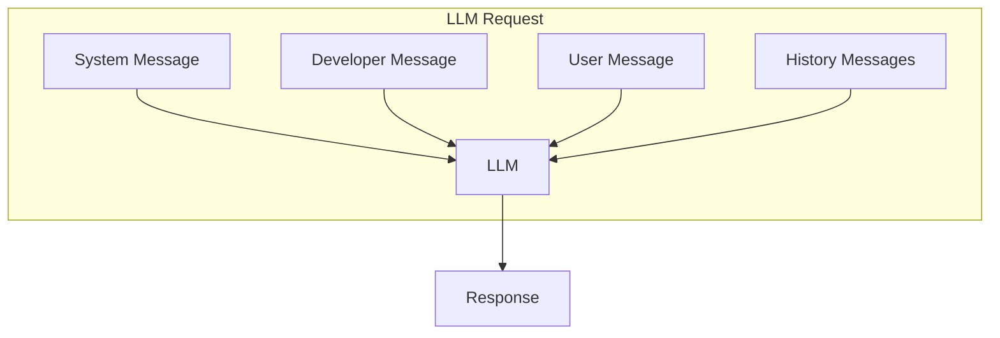
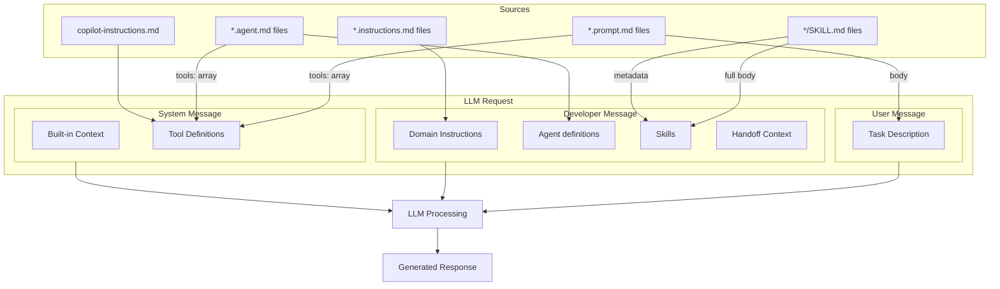

# LLM Message Structure Reference

## Complete Guide: Where Each Component Goes

This document explains exactly where each prompt component (frontmatter, instructions, agents, skills) gets injected into the LLM request across all three complexity levels.

---

## Understanding LLM Message Types

Every request to an LLM consists of structured **messages**. GitHub Copilot constructs these messages from various sources:

### Message Types



| Message Type | Purpose | Your Control |
|-------------|---------|--------------|
| **System** | Agent identity, tools, project context | ⚠️ Partial (copilot-instructions.md, tool filters) |
| **Developer** | Domain knowledge, rules, agent definitions | ✅ Full (instructions, agents, skills) |
| **User** | Your specific task/request | ✅ Full (prompt files, chat input) |
| **History** | Conversation context | ⚠️ Indirect (grows with turns) |

---

## Level 1: Basic (One-Shot Prompting)

### File → Message Mapping

```
.github/
├── copilot-instructions.md                    → SYSTEM MESSAGE
└── prompts/
    └── password-generator.prompt.md
        ├── frontmatter (description, mode, tools) → Configuration only
        └── body content                       → USER MESSAGE
```

### Complete Request Structure

```mermaid
flowchart TD
    subgraph System Message - 3000 tokens
        S1[Built-in: Agent role, date, OS]
        S2[copilot-instructions.md]
        S3[Tool definitions filtered by prompt tools array]
        S4[Workspace context]
    end
    
    subgraph Developer Message - 200 tokens
        D1[Minimal/empty in basic mode]
    end
    
    subgraph User Message - 300 tokens
        U1[prompt.md BODY content]
        U2[Everything after --- in .prompt.md]
    end
    
    System Message --> LLM[LLM]
    Developer Message --> LLM
    User Message --> LLM
    
    LLM --> Response
```

### Example: password-generator.prompt.md

```yaml
---
description: "Create password generator"   # Not sent to LLM (UI only)
mode: "agent"                              # Enables tools
tools: ["editFiles", "codebase"]          # Filters System Message tools
model: "claude-sonnet-4.5"                # Selects LLM
---

Create a password generator web app with:  # ← USER MESSAGE starts here
- Length selector (8-32 characters)
- Character type toggles
- Copy button

Use vanilla JavaScript, no frameworks.     # ← USER MESSAGE ends here
```

**Resulting LLM Request:**
- **System**: Built-in + copilot-instructions.md + only editFiles & codebase tools
- **Developer**: Empty/minimal
- **User**: "Create a password generator web app with..."

---

## Level 2: Intermediate (Instructed Agent)

### File → Message Mapping

```
.github/
├── copilot-instructions.md                              → SYSTEM MESSAGE
├── instructions/
│   ├── accessibility-rules.instructions.md              → DEVELOPER MESSAGE
│   ├── css-standards.instructions.md                    → DEVELOPER MESSAGE
│   ├── javascript-patterns.instructions.md              → DEVELOPER MESSAGE
│   ├── security-best-practices.instructions.md          → DEVELOPER MESSAGE
│   ├── testability-guidelines.instructions.md           → DEVELOPER MESSAGE
│   └── performance-best-practices.instructions.md       → DEVELOPER MESSAGE
├── skills/
│   ├── testing/SKILL.md
│   │   ├── frontmatter (name, description)              → DEVELOPER MESSAGE (metadata)
│   │   └── body                                         → DEVELOPER MESSAGE (on-demand)
│   └── security-validation/SKILL.md
│       ├── frontmatter (name, description)              → DEVELOPER MESSAGE (metadata)
│       └── body                                         → DEVELOPER MESSAGE (on-demand)
└── prompts/
    └── create-ui-component.prompt.md
        └── body content                                 → USER MESSAGE
```

### Complete Request Structure

```mermaid
flowchart TD
    subgraph System Message - 4000 tokens
        S1[Built-in: Agent role, date, OS]
        S2[copilot-instructions.md]
        S3[Tool definitions]
        S4[Workspace context - larger]
    end
    
    subgraph Developer Message - 3500 tokens
        D1[accessibility-rules.instructions.md BODY]
        D2[css-standards.instructions.md BODY]
        D3[javascript-patterns.instructions.md BODY]
        D4[security-best-practices.instructions.md BODY]
        D5[testability-guidelines.instructions.md BODY]
        D6[performance-best-practices.instructions.md BODY]
        D7[Skill metadata: name + description only]
    end
    
    subgraph User Message - 400 tokens
        U1[create-ui-component.prompt.md BODY]
    end
    
    System Message --> LLM[LLM]
    Developer Message --> LLM
    User Message --> LLM
    
    LLM --> Response[Response following ALL instructions]
```

### Instruction Loading: applyTo Pattern

Instructions are **conditionally loaded** based on file context:

```yaml
---
description: "CSS best practices"
applyTo: "**/*.css"                 # Only loaded when working with .css files
---

Use CSS custom properties for theming...  # ← DEVELOPER MESSAGE (when pattern matches)
```

**Example:** Working on `styles.css`
- ✅ `css-standards.instructions.md` (applyTo: `**/*.css`) → Loaded
- ✅ `accessibility-rules.instructions.md` (applyTo: `**/*.html,**/*.css`) → Loaded
- ❌ `javascript-patterns.instructions.md` (applyTo: `**/*.js`) → Not loaded

### Skill Loading: Progressive Disclosure

**Metadata always loaded:**
```yaml
---
name: testing-workflow
description: "Comprehensive testing for web apps"  # ← DEVELOPER MESSAGE (always)
---
```

**Full skill loaded on-demand:**
```markdown
# Testing Workflow                # ← DEVELOPER MESSAGE (when agent needs it)

## Steps
1. Write unit tests...
2. Run integration tests...
```

---

## Level 3: Advanced (Multi-Agent)

### File → Message Mapping (Per Agent)

```
.github/
├── copilot-instructions.md                              → SYSTEM MESSAGE (all agents)
├── agents/
│   ├── planner.agent.md
│   │   ├── frontmatter (description, tools, handoff)    → Configuration
│   │   │   └── tools: [...]                             → Filters SYSTEM MESSAGE
│   │   └── body                                         → DEVELOPER MESSAGE (Planner only)
│   ├── implementer.agent.md
│   │   ├── frontmatter (tools)                          → Filters SYSTEM MESSAGE
│   │   └── body                                         → DEVELOPER MESSAGE (Implementer only)
│   └── tester.agent.md
│       ├── frontmatter (tools)                          → Filters SYSTEM MESSAGE
│       └── body                                         → DEVELOPER MESSAGE (Tester only)
├── instructions/
│   └── *.instructions.md                                → DEVELOPER MESSAGE (all agents)
└── skills/
    └── */SKILL.md                                       → DEVELOPER MESSAGE (on-demand)
```

### Planner Agent Request

```mermaid
flowchart TD
    subgraph System Message - 4500 tokens
        S1[Built-in: Agent role, date, OS]
        S2[copilot-instructions.md]
        S3[Tools: ONLY codebase, semantic_search, read_file]
        S4[Workspace context]
    end
    
    subgraph Developer Message - 2000 tokens
        D1[planner.agent.md BODY]
        D2[advanced-planning.instructions.md BODY]
        D3[agent-orchestration.instructions.md BODY]
        D4[Skill metadata]
    end
    
    subgraph User Message - 300 tokens
        U1[From Coordinator: Plan this project]
    end
    
    System Message --> LLM[LLM]
    Developer Message --> LLM
    User Message --> LLM
    
    LLM --> Plan[Architectural Plan Output]
```

**Key:** `tools: ["codebase", "semantic_search", "read_file"]` in planner.agent.md frontmatter filters the System Message to **only** include these tools. Planner **cannot** edit files.

### Implementer Agent Request (with Handoff)

```mermaid
flowchart TD
    subgraph System Message - 5000 tokens
        S1[Built-in: Agent role, date, OS]
        S2[copilot-instructions.md]
        S3[Tools: ONLY editFiles, codebase, read_file]
        S4[Workspace context]
    end
    
    subgraph Developer Message - 3500 tokens
        D1[implementer.agent.md BODY]
        D2[security-best-practices.instructions.md]
        D3[performance-best-practices.instructions.md]
        D4[Full SKILL.md: testing/SKILL.md - 1200 tokens]
        D5[HANDOFF CONTEXT: Planner Plan - 700 tokens]
    end
    
    subgraph User Message - 400 tokens
        U1[From Coordinator: Implement according to plan]
    end
    
    System Message --> LLM[LLM]
    Developer Message --> LLM
    User Message --> LLM
    
    LLM --> Code[Implementation Output]
```

**Key:** The **Planner's output** is injected into the Implementer's **Developer Message** as handoff context. This is how agents communicate.

### Tester Agent Request (with Multiple Handoffs)

```mermaid
flowchart TD
    subgraph System Message - 4800 tokens
        S1[Built-in: Agent role, date, OS]
        S2[copilot-instructions.md]
        S3[Tools: ONLY codebase, read_file, run_tests]
        S4[Workspace context with generated files]
    end
    
    subgraph Developer Message - 4000 tokens
        D1[tester.agent.md BODY]
        D2[security-validation/SKILL.md - 1500 tokens]
        D3[testing/SKILL.md - 1200 tokens]
        D4[HANDOFF: Planner Plan - 300 tokens]
        D5[HANDOFF: Implementer Code Summary - 300 tokens]
    end
    
    subgraph User Message - 500 tokens
        U1[From Coordinator: Validate implementation]
    end
    
    System Message --> LLM[LLM]
    Developer Message --> LLM
    User Message --> LLM
    
    LLM --> Report[Validation Report]
```

**Key:** The Tester receives context from **both** previous agents in its Developer Message.

---

## Frontmatter Reference: What Goes Where

### Prompt Files (`.github/prompts/*.prompt.md`)

```yaml
---
description: "Task description"        # → Metadata only (UI display)
mode: "agent"                          # → Enables tool usage
tools: ["editFiles", "codebase"]      # → Filters System Message tools
model: "claude-sonnet-4.5"            # → Selects LLM model
---

Your actual prompt content here...    # → USER MESSAGE
```

### Instruction Files (`.github/instructions/*.instructions.md`)

```yaml
---
description: "Domain rules"            # → Metadata only
applyTo: "**/*.js"                    # → Pattern: when to inject
---

Instruction content here...            # → DEVELOPER MESSAGE (when pattern matches)
```

### Agent Files (`.github/agents/*.agent.md`)

```yaml
---
description: "Agent role"              # → Metadata only
tools: ["codebase", "editFiles"]      # → Filters System Message tools (this agent only)
handoff: ["other_agent"]              # → Enables agent routing
---

Agent role definition here...          # → DEVELOPER MESSAGE (this agent only)
```

### Skill Files (`.github/skills/{name}/SKILL.md`)

```yaml
---
name: skill-name-lowercase
description: "When to use"             # → DEVELOPER MESSAGE (metadata, always loaded)
license: MIT
---

Detailed skill instructions...         # → DEVELOPER MESSAGE (full body, on-demand)
```

### copilot-instructions.md

No frontmatter. Entire file → **SYSTEM MESSAGE** (all agents, all requests)

---

## Token Budget Comparison

### Level 1 Request

```
System Message:        3,000 tokens  ████████
Developer Message:       200 tokens  ░
User Message:            300 tokens  █
────────────────────────────────────
TOTAL:                ~3,500 tokens
```

### Level 2 Request

```
System Message:        4,000 tokens  ██████████
Developer Message:     3,500 tokens  ████████  ← Instructions!
User Message:            400 tokens  █
────────────────────────────────────
TOTAL:                ~7,900 tokens
```

### Level 3 Pipeline (All Agents)

```
Planner:               6,800 tokens  █████████████
  + Response:          1,500 tokens
Implementer:           8,900 tokens  █████████████████  ← Includes Plan
  + Response:          3,000 tokens
Tester:                9,300 tokens  ██████████████████  ← Includes Plan + Code
  + Response:          2,000 tokens
────────────────────────────────────
TOTAL:               ~31,500 tokens
```

---

## Key Takeaways

### System Message
- Contains built-in agent identity, date, OS, workspace
- Includes **copilot-instructions.md** (project baseline)
- Tool definitions **filtered by** `tools:` array in prompt/agent frontmatter
- You have **partial** control (via copilot-instructions.md and tool filters)

### Developer Message
- Contains **domain knowledge**: instructions, agents, skills
- **Level 1**: Minimal/empty
- **Level 2**: All matching `.instructions.md` files + skill metadata
- **Level 3**: Agent-specific `.agent.md` + instructions + full skills + **handoff context**
- You have **full** control (your instruction/agent/skill files)

### User Message
- Contains **your specific task**
- From `.prompt.md` file **body** (after frontmatter)
- OR from chat input
- You have **full** control

### History Messages
- Previous assistant responses
- Previous tool calls and results
- Grows with conversation turns
- You have **indirect** control (through conversation flow)

---

## Visualization: Complete Message Flow



---

## Quick Reference Table

| File Type | Frontend Property | Goes To | When | Control |
|-----------|------------------|---------|------|---------|
| `copilot-instructions.md` | N/A (entire file) | System Message | Always | ✅ Full |
| `.prompt.md` | `tools: [...]` | System Message (filter) | Always | ✅ Full |
| `.prompt.md` | body | User Message | Always | ✅ Full |
| `.instructions.md` | `applyTo: pattern` | Developer Message | When pattern matches | ✅ Full |
| `.agent.md` | `tools: [...]` | System Message (filter) | This agent only | ✅ Full |
| `.agent.md` | body | Developer Message | This agent only | ✅ Full |
| `SKILL.md` | `name`, `description` | Developer Message | Always (metadata) | ✅ Full |
| `SKILL.md` | body | Developer Message | On-demand (full) | ✅ Full |
| Previous agent output | N/A (handoff) | Developer Message | After handoff | ⚠️ Automated |

---

**For more context**, see the README files in each level:
- [Level 1 README](level-1-basic/README.md#prompt-anatomy-where-each-component-goes)
- [Level 2 README](level-2-intermediate/README.md#prompt-anatomy-message-structure-in-level-2)
- [Level 3 README](level-3-advanced/README.md#prompt-anatomy-multi-agent-message-structure)
