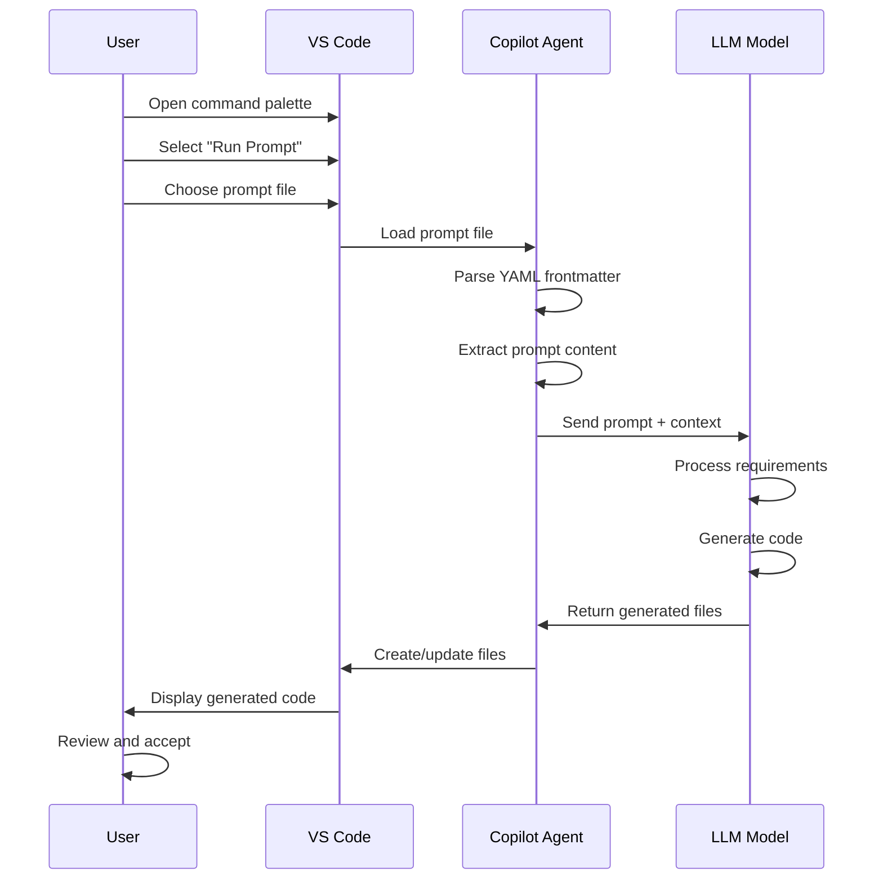
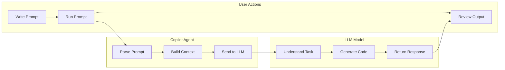
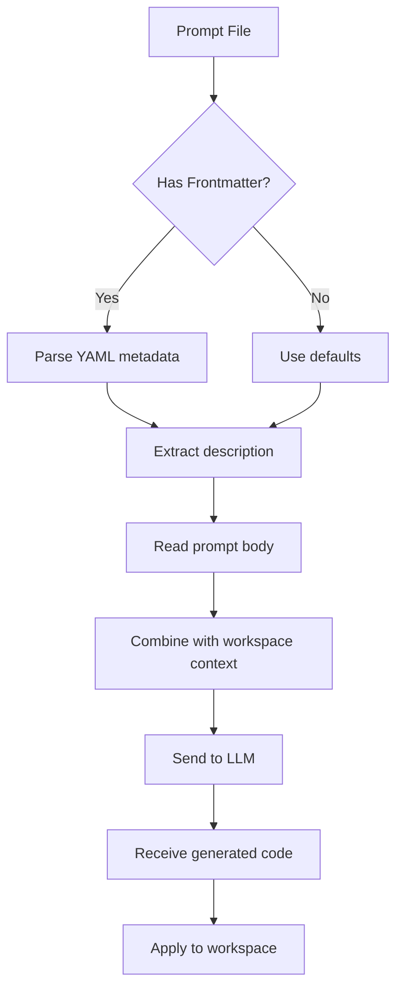
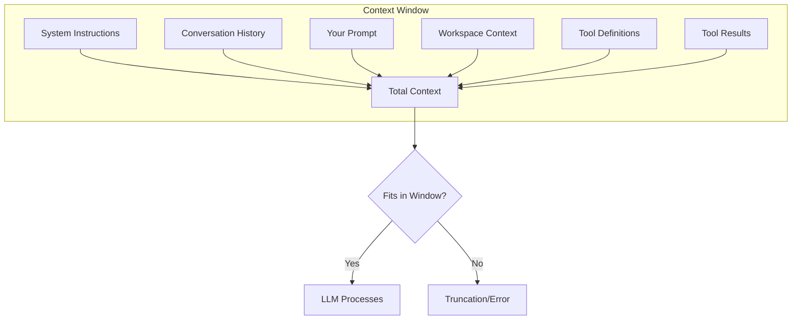
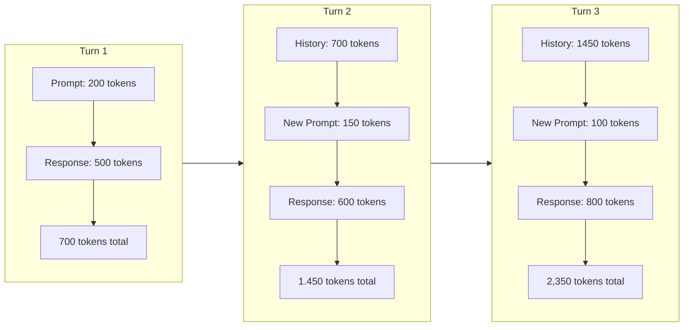
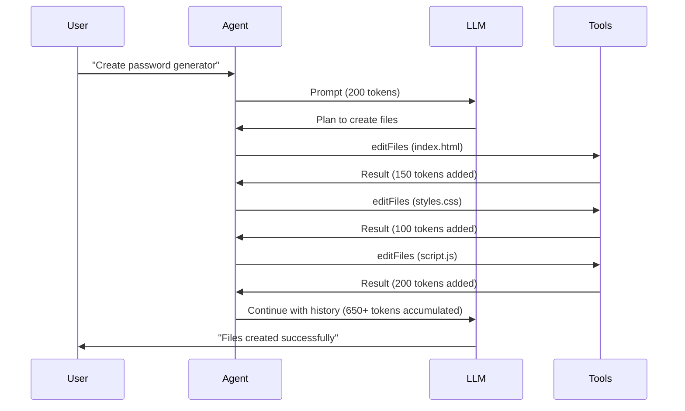

# Level 1: Basic - One-Shot Prompting

This directory contains a basic example of prompt engineering for a coding agent using GitHub Copilot.

## Concept: One-Shot Prompting

One-shot prompting involves providing the model with a single, comprehensive prompt that contains all the information needed to complete a task. This approach is:

- **Simple**: One prompt file, one task
- **Direct**: Clear requirements stated upfront
- **Flexible**: Model has freedom in implementation details

## Workflow Overview

The following diagram illustrates how the user, GitHub Copilot (LLM), and the agent interact in a one-shot prompting workflow:



### Component Interaction



### Prompt Processing Flow



## Prompt Size Considerations

One-shot prompts have practical limitations:

### Context Window Limits

- LLMs have a **maximum context window** (tokens that can be processed at once)
- Your prompt + workspace context + generated output must fit within this limit
- Typical limits range from 8K to 200K tokens depending on the model

### What Goes Into the Context?

Every interaction with the LLM includes multiple components that consume tokens:



| Component | Description | Approximate Size |
|-----------|-------------|------------------|
| **System Instructions** | Built-in rules for the agent | 500-2000 tokens |
| **Conversation History** | Previous messages in the chat | Grows with each turn |
| **Your Prompt** | The `.prompt.md` file content | 100-500 tokens |
| **Workspace Context** | Open files, selected code | 500-5000+ tokens |
| **Tool Definitions** | Available tools (edit, search, etc.) | 1000-3000 tokens |
| **Tool Results** | Output from tool executions | Varies greatly |

### How Context Grows During Iterations

Each interaction adds to the conversation history, causing the context to grow:



**Example: Context Growth Over 5 Iterations**

| Turn | History | New Input | Tools Used | Tool Output | Total Context |
|------|---------|-----------|------------|-------------|---------------|
| 1 | 0 | 200 | 0 | 0 | ~3,200 (base + prompt) |
| 2 | 700 | 150 | 1 file read | 500 | ~4,550 |
| 3 | 1,350 | 100 | 2 edits | 300 | ~5,050 |
| 4 | 2,050 | 200 | 1 search | 800 | ~6,350 |
| 5 | 3,350 | 150 | 3 edits | 600 | ~7,400 |

### Tool Usage Impact on Context

When the agent uses tools, both the tool call and its result consume tokens:



**Common Tools and Their Context Cost:**

| Tool | Typical Input | Typical Output | Notes |
|------|---------------|----------------|-------|
| `editFiles` | 50-200 tokens | 50-150 tokens | Per file operation |
| `readFile` | 20 tokens | 100-2000 tokens | Depends on file size |
| `search` | 30 tokens | 200-1000 tokens | Multiple results |
| `runCommands` | 30 tokens | 50-500 tokens | Command output varies |
| `codebase` | 50 tokens | 500-3000 tokens | Semantic search results |

### Why This Matters for One-Shot Prompting

In Level 1 (one-shot), you typically:
- Send **one prompt** → get **one response**
- Minimal tool usage (just file creation)
- Context stays relatively small

**Advantages:**
- ✅ Lower token usage
- ✅ Faster responses
- ✅ Less chance of context overflow

**Trade-offs:**
- ❌ No iterative refinement in same session
- ❌ Must include all requirements upfront
- ❌ Can't reference previous conversation

### Working Around Size Limits

1. **Be concise**: Focus on essential requirements only
2. **Use examples sparingly**: One good example is better than many mediocre ones
3. **Reference, don't repeat**: Point to existing patterns in your codebase
4. **Split large tasks**: Break into multiple prompts if needed
5. **Prioritize requirements**: Put the most important items first
6. **Start fresh**: Begin a new chat session to reset history

### Token Estimation

| Content Type | Approximate Tokens |
|--------------|-------------------|
| 1 line of code | 10-20 tokens |
| 100 words of text | ~130 tokens |
| Small function | 50-100 tokens |
| Full HTML page | 200-500 tokens |
| Typical prompt file | 100-300 tokens |
| File read (medium file) | 500-1500 tokens |

## The Task

Create a secure password generator web app using HTML, CSS, and JavaScript.

## Folder Structure

```text
level-1-basic/
├── .github/
│   ├── copilot-instructions.md    # Project-level instructions
│   └── prompts/
│       ├── password-generator-simple.prompt.md   # Minimal guidance prompt
│       └── password-generator-styled.prompt.md   # Styled prompt with example CSS
└── README.md
```

## Files

### Prompts (`.github/prompts/`)

- **password-generator-simple.prompt.md**: Basic one-shot prompt with minimal guidance. Good for quick prototypes.
- **password-generator-styled.prompt.md**: Enhanced prompt with specific styling example. Demonstrates how to constrain visual output.

### Instructions (`.github/`)

- **copilot-instructions.md**: Project-level instructions that apply to all interactions.

## How to Use

1. Open VS Code with GitHub Copilot
2. Open the command palette (`Ctrl+Shift+P` / `Cmd+Shift+P`)
3. Select "GitHub Copilot: Run Prompt"
4. Choose one of the prompt files
5. Review and accept the generated code

## Key Differences from Level 2 & 3

| Aspect | Level 1 (Basic) |
|--------|-----------------|
| Prompt Count | 1-2 prompts per task |
| Instructions | Minimal or none |
| Predictability | Lower - model has freedom |
| Best For | Quick prototypes, exploration |
| Complexity | Simple, direct tasks |

## Learning Objectives

- Understand basic prompt structure with YAML frontmatter
- Learn how to write clear, actionable prompts
- See how styling examples can constrain output

