# Level 1: Basic - One-Shot Prompting

This directory contains a basic example of prompt engineering for a coding agent using GitHub Copilot.

> **📖 Complete Message Structure Guide**: For a detailed explanation of exactly where each prompt component (frontmatter, body, instructions) goes in the LLM request, see [MESSAGE-STRUCTURE-REFERENCE.md](../MESSAGE-STRUCTURE-REFERENCE.md)

## Concept: One-Shot Prompting

One-shot prompting involves providing the model with a single, comprehensive prompt that contains all the information needed to complete a task. This approach is:

- **Simple**: One prompt file, one task
- **Direct**: Clear requirements stated upfront
- **Flexible**: Model has freedom in implementation details

## Workflow Overview

The following diagram illustrates how the user, GitHub Copilot (LLM), and the agent interact in a one-shot prompting workflow:

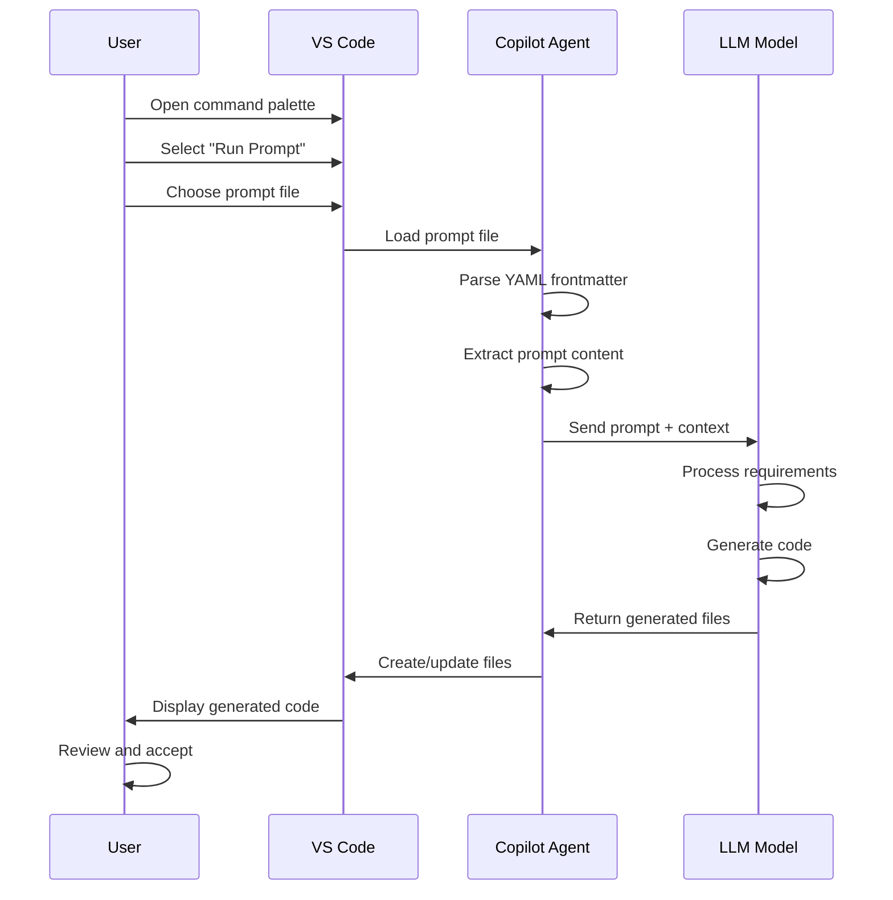
```mermaid
sequenceDiagram
    participant User
    participant VSCode as VS Code
    participant Agent as Copilot Agent
    participant LLM as LLM Model

    User->>VSCode: Open command palette
    User->>VSCode: Select "Run Prompt"
    User->>VSCode: Choose prompt file
    VSCode->>Agent: Load prompt file
    Agent->>Agent: Parse YAML frontmatter
    Agent->>Agent: Extract prompt content
    Agent->>LLM: Send prompt + context
    LLM->>LLM: Process requirements
    LLM->>LLM: Generate code
    LLM->>Agent: Return generated files
    Agent->>VSCode: Create/update files
    VSCode->>User: Display generated code
    User->>User: Review and accept
```

### Component Interaction

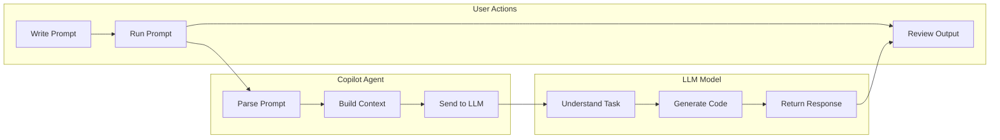
```mermaid
flowchart LR
    subgraph User Actions
        A[Write Prompt] --> B[Run Prompt]
        B --> C[Review Output]
    end

    subgraph Copilot Agent
        D[Parse Prompt] --> E[Build Context]
        E --> F[Send to LLM]
    end

    subgraph LLM Model
        G[Understand Task] --> H[Generate Code]
        H --> I[Return Response]
    end

    B --> D
    F --> G
    I --> C
```

### Prompt Processing Flow

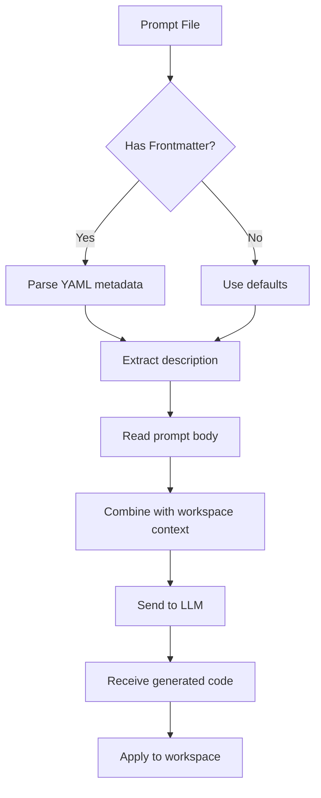
```mermaid
flowchart TD
    A[Prompt File] --> B{Has Frontmatter?}
    B -->|Yes| C[Parse YAML metadata]
    B -->|No| D[Use defaults]
    C --> E[Extract description]
    D --> E
    E --> F[Read prompt body]
    F --> G[Combine with workspace context]
    G --> H[Send to LLM]
    H --> I[Receive generated code]
    I --> J[Apply to workspace]
```

## Prompt Anatomy: Where Each Component Goes

Understanding how GitHub Copilot structures LLM requests is critical for effective prompt engineering. Every request is composed of multiple **messages** that are sent to the LLM in a specific structure.

### LLM Request Structure

When you run a prompt, Copilot constructs a multi-message request. Different LLM providers use slightly different message types, but the core structure is:

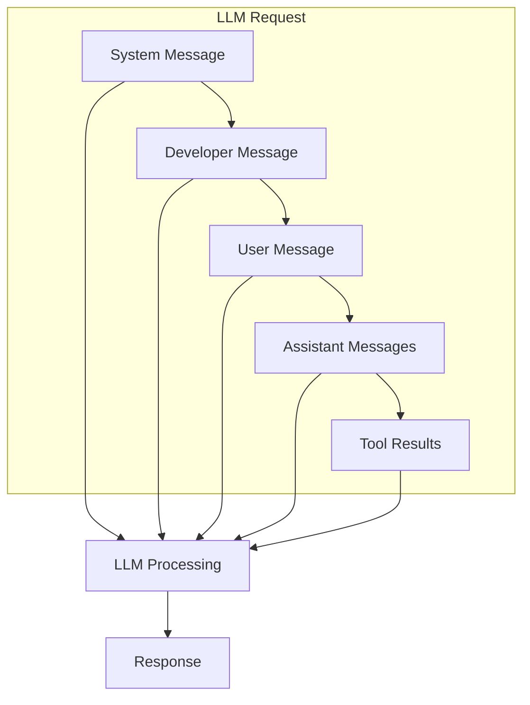
```mermaid
flowchart TD
    subgraph LLM Request
        direction TB
        A[System Message] --> B[Developer Message]
        B --> C[User Message]
        C --> D[Assistant Messages]
        D --> E[Tool Results]
    end
    
    A --> F[LLM Processing]
    B --> F
    C --> F
    D --> F
    E --> F
    
    F --> G[Response]
```

### Message Types and Their Contents

#### 1. System Message
**Purpose**: Establishes the agent's identity, capabilities, and core behavior  
**Managed by**: GitHub Copilot (you don't control this directly)

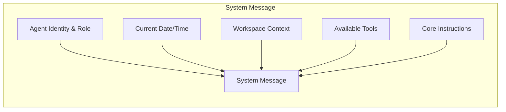
```mermaid
flowchart LR
    subgraph System Message
        direction TB
        A[Agent Identity & Role]
        B[Current Date/Time]
        C[Workspace Context]
        D[Available Tools]
        E[Core Instructions]
        
        A --> F[System Message]
        B --> F
        C --> F
        D --> F
        E --> F
    end
```

**What Goes in the System Message:**
- **Agent role**: "You are an expert AI programming assistant..."
- **Current date**: "The current date is March 3, 2026"
- **OS information**: "The user's current OS is: Windows"
- **Workspace structure**: File tree, open files
- **Tool definitions**: Available functions like `editFiles`, `codebase`, `runInTerminal`
- **Built-in rules**: Content policies, coding guidelines
- **Repository instructions**: Content from `.github/copilot-instructions.md`

**Approximate size**: 3,000-10,000 tokens (depending on workspace size)

#### 2. Developer Message (Anthropic) / Additional System Context (OpenAI)
**Purpose**: Domain-specific instructions and project rules  
**Managed by**: `.github/instructions/*.instructions.md` files

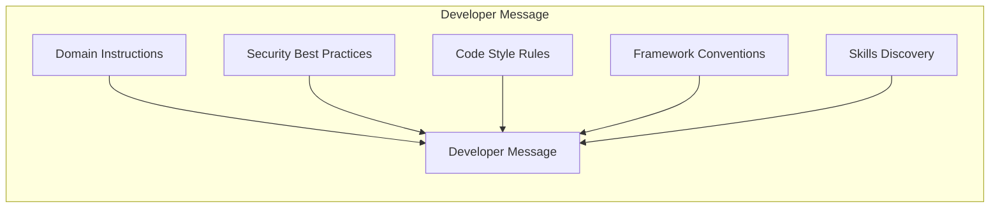
```mermaid
flowchart LR
    subgraph Developer Message
        direction TB
        A[Domain Instructions]
        B[Security Best Practices]
        C[Code Style Rules]
        D[Framework Conventions]
        E[Skills Discovery]
        
        A --> F[Developer Message]
        B --> F
        C --> F
        D --> F
        E --> F
    end
```

**What Goes in the Developer Message:**
- **Instruction files**: Content from `.github/instructions/*.instructions.md`
- **Agent definitions**: Content from `.github/agents/*.agent.md` (when in agent mode)
- **Skill metadata**: Skill names and descriptions (full SKILL.md loaded on-demand)
- **applyTo rules**: File pattern-based instruction activation

**Example Content:**
```markdown
<instruction file="security-best-practices.instructions.md">
- Always sanitize user input
- Use parameterized queries
- Implement CSP headers
</instruction>

<instruction file="javascript-patterns.instructions.md">
- Use async/await for asynchronous code
- Prefer const over let
- Use strict mode
</instruction>
```

**Approximate size**: 500-5,000 tokens (grows with instruction files)

#### 3. User Message
**Purpose**: Your actual request - what you want the agent to do  
**Managed by**: Your prompt file or chat input

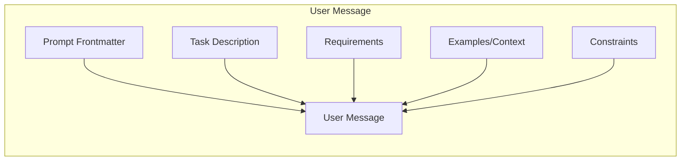
```mermaid
flowchart LR
    subgraph User Message
        direction TB
        A[Prompt Frontmatter]
        B[Task Description]
        C[Requirements]
        D[Examples/Context]
        E[Constraints]
        
        A --> F[User Message]
        B --> F
        C --> F
        D --> F
        E --> F
    end
```

**What Goes in the User Message:**
- **From `.prompt.md` files**: The markdown body (after frontmatter)
- **From chat input**: Your typed message
- **Attached context**: Selected code, files, or references

**Example Content:**
```markdown
Create a password generator web app with the following features:
- Length selection (8-32 characters)
- Character type toggles (uppercase, lowercase, numbers, symbols)
- Copy to clipboard button
- Strength indicator

Use vanilla JavaScript, no frameworks.
```

**Approximate size**: 100-1,000 tokens (your prompt)

#### 4. Assistant Messages + Tool Results
**Purpose**: Conversation history and tool execution results  
**Managed by**: The agent's responses and tool calls

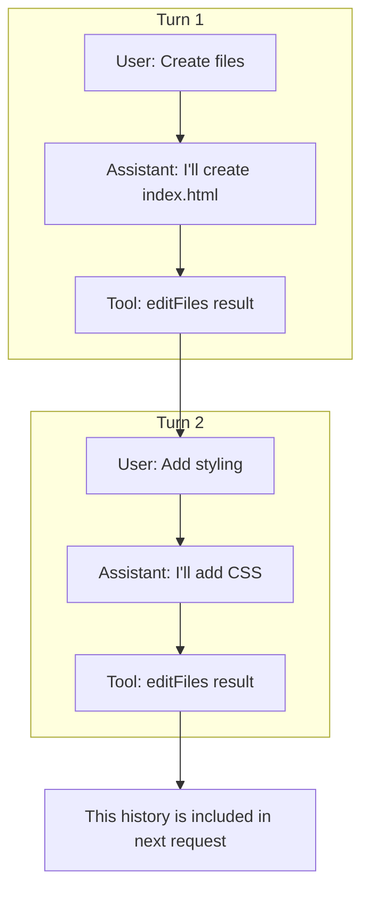
```mermaid
flowchart TD
    subgraph Turn 1
        A1[User: Create files] --> B1[Assistant: I'll create index.html]
        B1 --> C1[Tool: editFiles result]
    end
    
    subgraph Turn 2
        C1 --> A2[User: Add styling]
        A2 --> B2[Assistant: I'll add CSS]
        B2 --> C2[Tool: editFiles result]
    end
    
    C2 --> D[This history is included in next request]
```

**What Goes in Assistant/Tool Messages:**
- **Assistant responses**: The agent's replies
- **Tool calls**: Requests to use tools (edit files, run commands, search)
- **Tool results**: Output from tool executions

**Approximate size**: Grows with each turn (500-5,000+ tokens)

### Complete Request Composition

Here's what a complete LLM request looks like when you run a prompt:

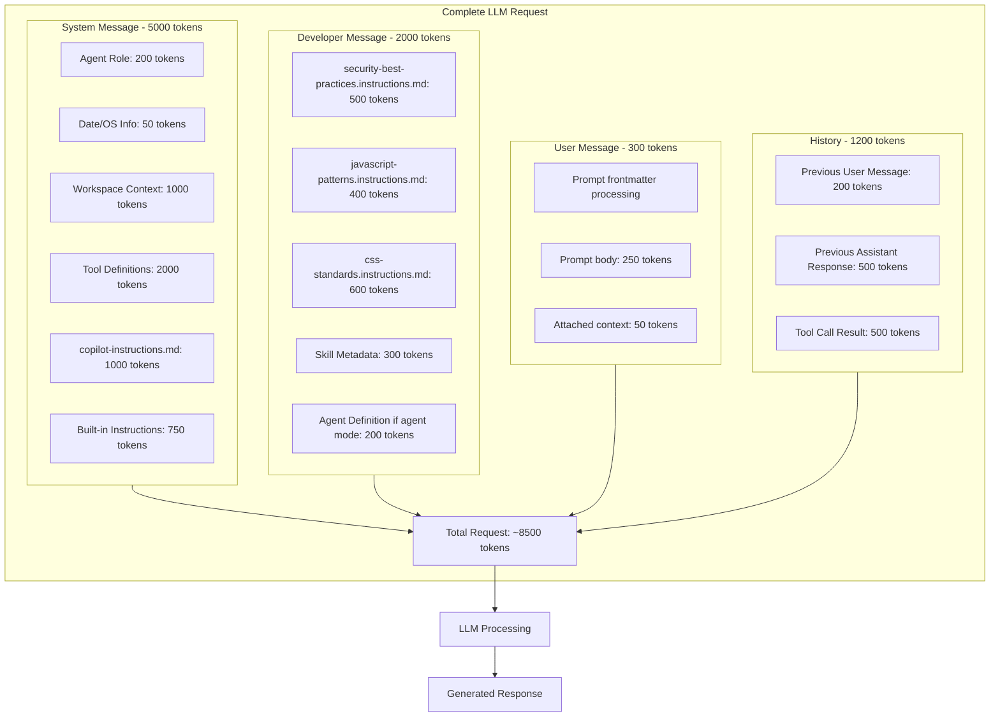
```mermaid
flowchart TD
    subgraph Complete LLM Request
        direction TB
        
        subgraph SM[System Message - 5000 tokens]
            SM1[Agent Role: 200 tokens]
            SM2[Date/OS Info: 50 tokens]
            SM3[Workspace Context: 1000 tokens]
            SM4[Tool Definitions: 2000 tokens]
            SM5[copilot-instructions.md: 1000 tokens]
            SM6[Built-in Instructions: 750 tokens]
        end
        
        subgraph DM[Developer Message - 2000 tokens]
            DM1[security-best-practices.instructions.md: 500 tokens]
            DM2[javascript-patterns.instructions.md: 400 tokens]
            DM3[css-standards.instructions.md: 600 tokens]
            DM4[Skill Metadata: 300 tokens]
            DM5[Agent Definition if agent mode: 200 tokens]
        end
        
        subgraph UM[User Message - 300 tokens]
            UM1[Prompt frontmatter processing]
            UM2[Prompt body: 250 tokens]
            UM3[Attached context: 50 tokens]
        end
        
        subgraph HM[History - 1200 tokens]
            HM1[Previous User Message: 200 tokens]
            HM2[Previous Assistant Response: 500 tokens]
            HM3[Tool Call Result: 500 tokens]
        end
        
        SM --> Total[Total Request: ~8500 tokens]
        DM --> Total
        UM --> Total
        HM --> Total
    end
    
    Total --> LLM[LLM Processing]
    LLM --> Response[Generated Response]
```

### Token Allocation Breakdown

Here's a typical token distribution for a Level 1 one-shot prompt:

| Component | Source | Token Range | Your Control |
|-----------|--------|-------------|--------------|
| **Agent Identity** | Built-in | 200-500 | ❌ None |
| **Date/OS/Workspace** | Built-in | 100-2000 | ❌ None |
| **Tool Definitions** | Built-in | 1500-3000 | ❌ None |
| **copilot-instructions.md** | Repository | 200-2000 | ✅ Full |
| **Built-in Policies** | Built-in | 500-1000 | ❌ None |
| **Instruction Files** | `.github/instructions/` | 0-5000 | ✅ Full |
| **Agent Definitions** | `.github/agents/` | 0-2000 | ✅ Full |
| **Skill Metadata** | `.github/skills/` | 0-1000 | ✅ Partial |
| **Your Prompt** | `.prompt.md` or chat | 100-1000 | ✅ Full |
| **Conversation History** | Previous turns | 0-10000+ | ⚠️ Indirect |
| **Tool Results** | Tool executions | 0-5000+ | ⚠️ Indirect |

**Total Baseline** (before your content): ~3,000-8,000 tokens  
**With your content**: ~3,500-15,000+ tokens

### Where Your Prompt File Content Goes

When you create a `.prompt.md` file, here's exactly where each part ends up:

```markdown
---
description: "Create password generator"  ← Metadata (not sent to LLM)
model: "claude-sonnet-4.5"               ← Model selection (not sent)
tools: ["editFiles", "codebase"]         ← Tool restrictions (filters System Message)
---

Create a password generator with:        ← User Message starts here
- Length selector (8-32 chars)          
- Character type toggles                
- Copy button                           
- Strength indicator                    ← User Message ends here

Use vanilla JavaScript, no frameworks.   
```

**Frontmatter Processing:**
1. `description`: Shown in VS Code, not sent to LLM
2. `model`: Determines which LLM to use (Sonnet, GPT-4, etc.)
3. `tools`: Filters which tools appear in System Message
4. Everything after `---`: Becomes the User Message

### Practical Implications

**For One-Shot Prompting (Level 1):**
- You control: ~300-1000 tokens (your prompt + copilot-instructions.md)
- System controls: ~3000-7000 tokens (built-in context)
- **Strategy**: Make your prompt clear and complete, but concise
- **Limitation**: Can't rely on conversation history for clarification

**Example Token Budget:**
```
System Message:     5,000 tokens  (built-in, you can't change)
Developer Message:    500 tokens  (if you add instructions)
User Message:         300 tokens  (your .prompt.md)
Response Budget:    4,000 tokens  (for generated code)
──────────────────────────────────
Total Request:      9,800 tokens
```

With a 128K context window (e.g., Claude Sonnet), you have plenty of room. With an 8K window, you're constrained.

## Prompt Size Considerations

One-shot prompts have practical limitations:

### Context Window Limits

- LLMs have a **maximum context window** (tokens that can be processed at once)
- Your prompt + workspace context + generated output must fit within this limit
- Typical limits range from 8K to 200K tokens depending on the model

### What Goes Into the Context?

Every interaction with the LLM includes multiple components that consume tokens:

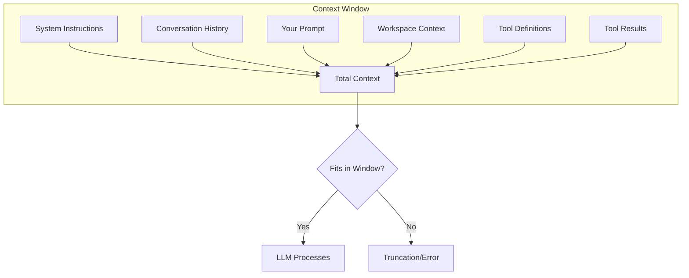
```mermaid
flowchart TD
    subgraph Context Window
        A[System Instructions] --> T[Total Context]
        B[Conversation History] --> T
        C[Your Prompt] --> T
        D[Workspace Context] --> T
        E[Tool Definitions] --> T
        F[Tool Results] --> T
    end
    
    T --> G{Fits in Window?}
    G -->|Yes| H[LLM Processes]
    G -->|No| I[Truncation/Error]
```

| Component | Description | Approximate Size |
|-----------|-------------|------------------|
| **System Instructions** | Built-in rules for the agent | 500-2000 tokens |
| **Conversation History** | Previous messages in the chat | Grows with each turn |
| **Your Prompt** | The `.prompt.md` file content | 100-500 tokens |
| **Workspace Context** | Open files, selected code | 500-5000+ tokens |
| **Tool Definitions** | Available tools (edit, search, etc.) | 1000-3000 tokens |
| **Tool Results** | Output from tool executions | Varies greatly |

### How Context Grows During Iterations

Each interaction adds to the conversation history, causing the context to grow:

```mermaid
flowchart LR
    subgraph Turn 1
        A1[Prompt: 200 tokens]
        B1[Response: 500 tokens]
    end
    
    subgraph Turn 2
        A2[History: 700 tokens]
        B2[New Prompt: 150 tokens]
        C2[Response: 600 tokens]
    end
    
    subgraph Turn 3
        A3[History: 1450 tokens]
        B3[New Prompt: 100 tokens]
        C3[Response: 800 tokens]
    end
    
    Turn 1 --> Turn 2 --> Turn 3
```

**Example: Context Growth Over 5 Iterations**

| Turn | History | New Input | Tools Used | Tool Output | Total Context |
|------|---------|-----------|------------|-------------|---------------|
| 1 | 0 | 200 | 0 | 0 | ~3,200 (base + prompt) |
| 2 | 700 | 150 | 1 file read | 500 | ~4,550 |
| 3 | 1,350 | 100 | 2 edits | 300 | ~5,050 |
| 4 | 2,050 | 200 | 1 search | 800 | ~6,350 |
| 5 | 3,350 | 150 | 3 edits | 600 | ~7,400 |

### Tool Usage Impact on Context

When the agent uses tools, both the tool call and its result consume tokens:

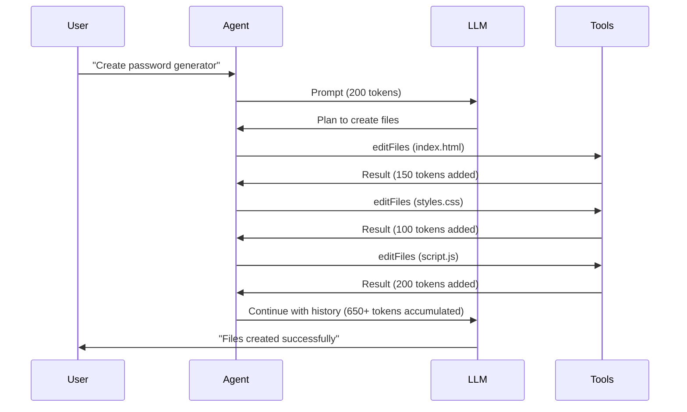
```mermaid
sequenceDiagram
    participant User
    participant Agent
    participant LLM
    participant Tools

    User->>Agent: "Create password generator"
    Agent->>LLM: Prompt (200 tokens)
    LLM->>Agent: Plan to create files
    Agent->>Tools: editFiles (index.html)
    Tools->>Agent: Result (150 tokens added)
    Agent->>Tools: editFiles (styles.css)
    Tools->>Agent: Result (100 tokens added)
    Agent->>Tools: editFiles (script.js)
    Tools->>Agent: Result (200 tokens added)
    Agent->>LLM: Continue with history (650+ tokens accumulated)
    LLM->>User: "Files created successfully"
```

**Common Tools and Their Context Cost:**

| Tool | Typical Input | Typical Output | Notes |
|------|---------------|----------------|-------|
| `editFiles` | 50-200 tokens | 50-150 tokens | Per file operation |
| `readFile` | 20 tokens | 100-2000 tokens | Depends on file size |
| `search` | 30 tokens | 200-1000 tokens | Multiple results |
| `runCommands` | 30 tokens | 50-500 tokens | Command output varies |
| `codebase` | 50 tokens | 500-3000 tokens | Semantic search results |

### Why This Matters for One-Shot Prompting

In Level 1 (one-shot), you typically:
- Send **one prompt** → get **one response**
- Minimal tool usage (just file creation)
- Context stays relatively small

**Advantages:**
- ✅ Lower token usage
- ✅ Faster responses
- ✅ Less chance of context overflow

**Trade-offs:**
- ❌ No iterative refinement in same session
- ❌ Must include all requirements upfront
- ❌ Can't reference previous conversation

### Working Around Size Limits

1. **Be concise**: Focus on essential requirements only
2. **Use examples sparingly**: One good example is better than many mediocre ones
3. **Reference, don't repeat**: Point to existing patterns in your codebase
4. **Split large tasks**: Break into multiple prompts if needed
5. **Prioritize requirements**: Put the most important items first
6. **Start fresh**: Begin a new chat session to reset history

### Token Estimation

| Content Type | Approximate Tokens |
|--------------|-------------------|
| 1 line of code | 10-20 tokens |
| 100 words of text | ~130 tokens |
| Small function | 50-100 tokens |
| Full HTML page | 200-500 tokens |
| Typical prompt file | 100-300 tokens |
| File read (medium file) | 500-1500 tokens |

## The Task

Create a secure password generator web app using HTML, CSS, and JavaScript.

## Folder Structure

```text
level-1-basic/
├── .github/
│   ├── copilot-instructions.md    # Project-level instructions
│   └── prompts/
│       ├── password-generator-simple.prompt.md   # Minimal guidance prompt
│       └── password-generator-styled.prompt.md   # Styled prompt with example CSS
└── README.md
```

## Files

### Prompts (`.github/prompts/`)

- **password-generator-simple.prompt.md**: Basic one-shot prompt with minimal guidance. Good for quick prototypes.
- **password-generator-styled.prompt.md**: Enhanced prompt with specific styling example. Demonstrates how to constrain visual output.

### Instructions (`.github/`)

- **copilot-instructions.md**: Project-level instructions that apply to all interactions.

## How to Use

1. Open VS Code with GitHub Copilot
2. Open the command palette (`Ctrl+Shift+P` / `Cmd+Shift+P`)
3. Select "GitHub Copilot: Run Prompt"
4. Choose one of the prompt files
5. Review and accept the generated code

## Key Differences from Level 2 & 3

| Aspect | Level 1 (Basic) |
|--------|-----------------|
| Prompt Count | 1-2 prompts per task |
| Instructions | Minimal or none |
| Predictability | Lower - model has freedom |
| Best For | Quick prototypes, exploration |
| Complexity | Simple, direct tasks |

## Learning Objectives

- Understand basic prompt structure with YAML frontmatter
- Learn how to write clear, actionable prompts
- See how styling examples can constrain output

## Link utili (Copilot + prompt files)

- GitHub Copilot docs: https://docs.github.com/en/copilot
- GitHub Copilot (repository custom instructions): https://docs.github.com/en/copilot/customizing-copilot/adding-repository-custom-instructions-for-github-copilot
- VS Code Copilot Chat docs (prompt files / agent mode): https://code.visualstudio.com/docs/copilot/copilot-chat
- Esempi community (prompts/instructions):
    - https://github.com/github/awesome-copilot/tree/main/prompts
    - https://github.com/github/awesome-copilot/tree/main/instructions

## Quick Reference: LLM Message Structure

### Message Type Summary

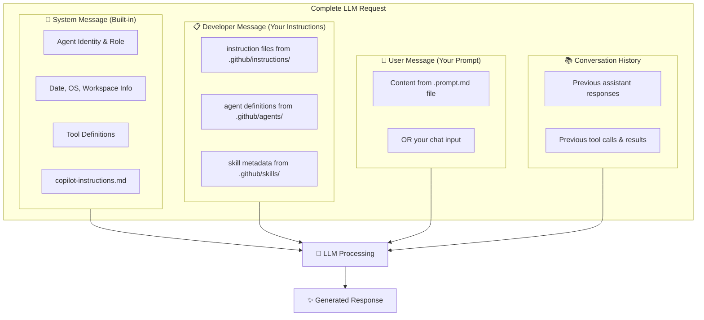
```mermaid
flowchart TD
    subgraph Request["Complete LLM Request"]
        direction TB
        
        subgraph System["🔧 System Message (Built-in)"]
            S1["Agent Identity & Role"]
            S2["Date, OS, Workspace Info"]
            S3["Tool Definitions"]
            S4["copilot-instructions.md"]
        end
        
        subgraph Developer["📋 Developer Message (Your Instructions)"]
            D1["instruction files from .github/instructions/"]
            D2["agent definitions from .github/agents/"]
            D3["skill metadata from .github/skills/"]
        end
        
        subgraph User["💬 User Message (Your Prompt)"]
            U1["Content from .prompt.md file"]
            U2["OR your chat input"]
        end
        
        subgraph History["📚 Conversation History"]
            H1["Previous assistant responses"]
            H2["Previous tool calls & results"]
        end
    end
    
    System --> LLM["🤖 LLM Processing"]
    Developer --> LLM
    User --> LLM
    History --> LLM
    
    LLM --> Response["✨ Generated Response"]
```

### What You Control in Level 1

| Message Type | Your Control | How | Impact |
|-------------|--------------|-----|--------|
| **System** | ⚠️ Partial | `copilot-instructions.md`, tool restrictions in prompt frontmatter | Baseline behavior, available tools |
| **Developer** | ❌ Minimal | Not used in basic prompts | N/A |
| **User** | ✅ Full | Your `.prompt.md` file content | Direct task specification |
| **History** | ⚠️ Indirect | Conversation flow | Grows with iterations |

### Token Budget Visualization

```
┌─────────────────────────────────────────────────────────────────┐
│ Context Window: 128,000 tokens (Claude Sonnet 4.5)            │
├─────────────────────────────────────────────────────────────────┤
│ ████████████████░░░░░░░░░░░░░░░░░░░░░░░░░░░░░░░░░░░░░░░░░░░░░│
│ ↑                                                               │
│ Used: ~5,000 tokens                                            │
│                                                                 │
│ System Message:        3,000 tokens  ████████                 │
│ Developer Message:       200 tokens  ░                        │
│ User Message:            300 tokens  █                        │
│ Response Budget:      ~5,000 tokens  ████████████              │
└─────────────────────────────────────────────────────────────────┘
```

**Plenty of room for generation!** ✅

### Mini-cheatsheet: frontmatter (YAML)

**Prompt** (`.github/prompts/*.prompt.md`)

```yaml
---
description: "Cosa fa questo prompt"
mode: "agent" # oppure: "chat"
tools: ["editFiles", "runInTerminal"] # opzionale
---
```

**Instructions** (`.github/instructions/*.instructions.md`)

```yaml
---
description: "Regole riusabili (brevi)"
applyTo: "**/*.js"
---
```

**Agent** (`.github/agents/*.agent.md`)

```yaml
---
description: "Ruolo dell’agente"
tools: ["codebase", "editFiles"]
---
```


## Nanoagent: Executable Python Example

The `nanoagent/` folder contains a minimal Python implementation that demonstrates the same one-shot pattern in executable code.

### What It Demonstrates
- Single LLM call (prompt in → response out)
- No tools, no memory, no orchestration
- Provider-agnostic using litellm

### Quick Start
```bash
cd nanoagent
uv sync
uv run agent.py --mock "Generate a secure password"
```

See `nanoagent/README.md` for full documentation.
