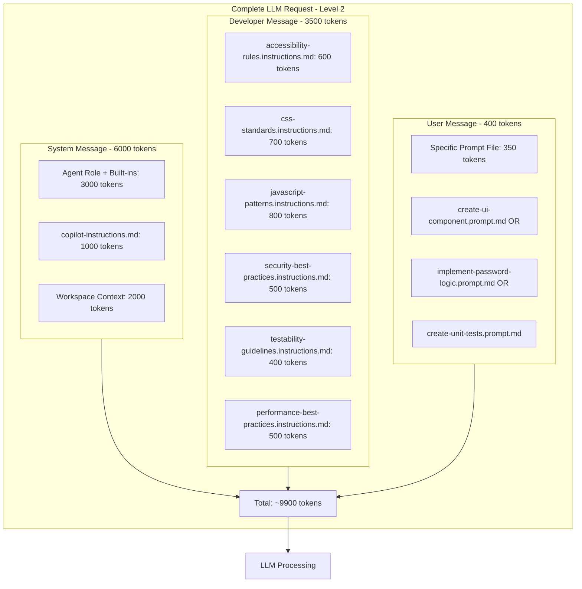
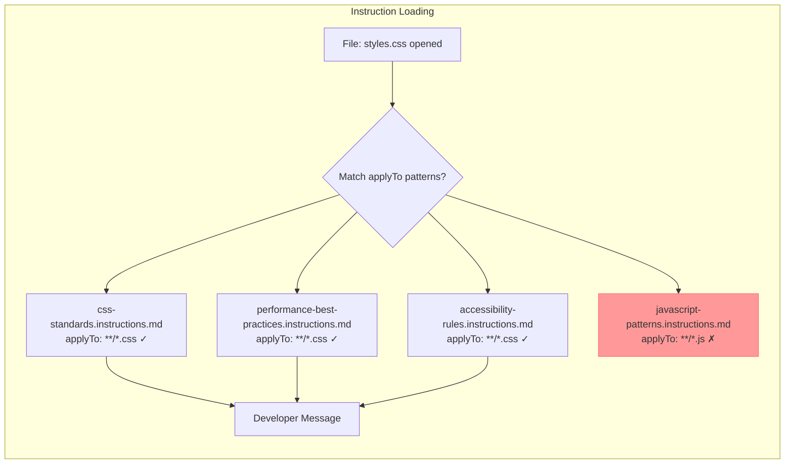
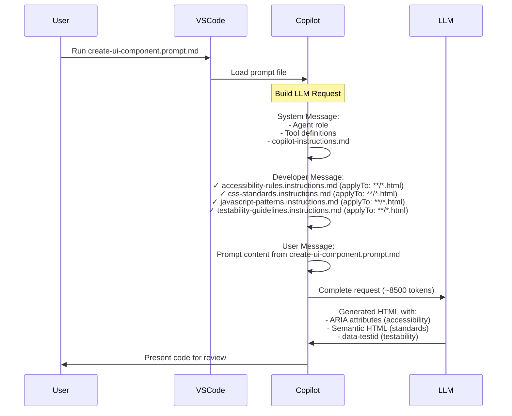
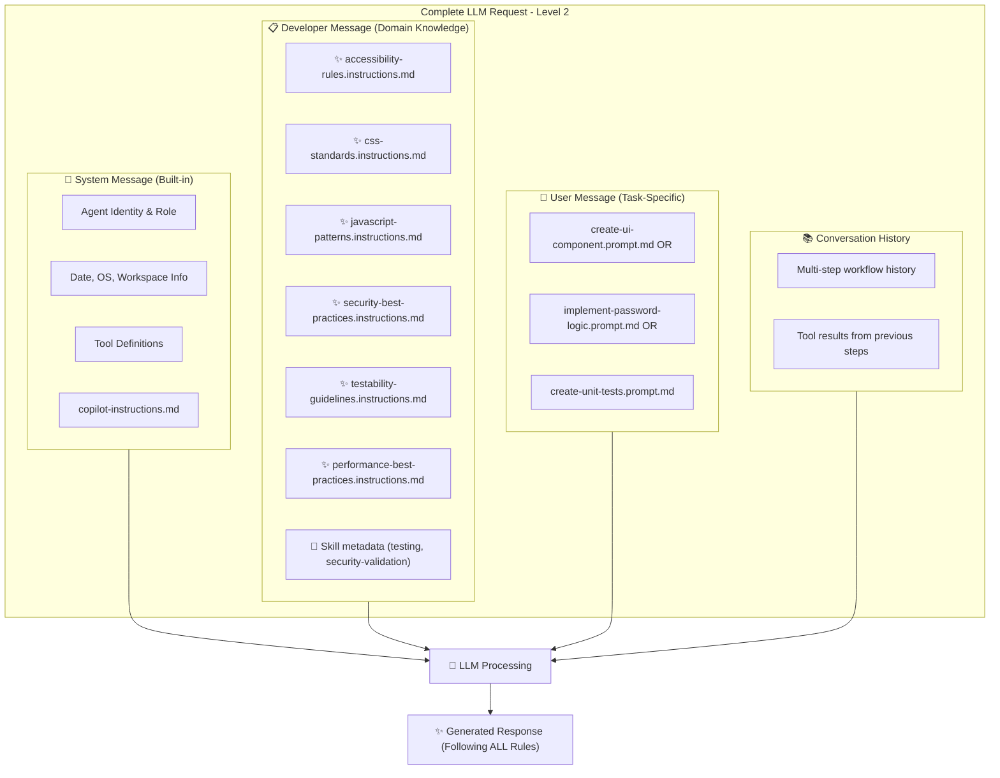
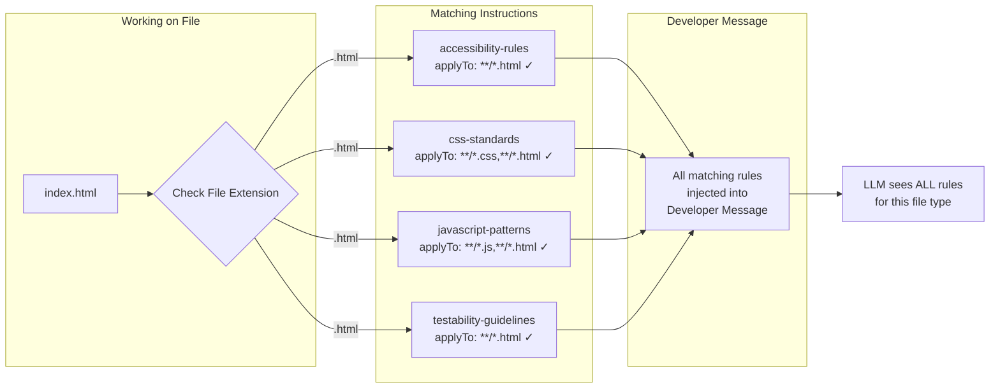

# Level 2: Intermediate - Predictable Output with Domain Instructions

This level focuses on **predictability and consistency** by using domain-specific instructions and task-specific prompts.

> **📖 Complete Message Structure Guide**: For a detailed explanation of exactly where instructions are injected into the LLM request, see [MESSAGE-STRUCTURE-REFERENCE.md](../MESSAGE-STRUCTURE-REFERENCE.md)

## Concept: Separation of Concerns

By separating **domain knowledge** (instructions) from **task execution** (prompts), we ensure:

- Consistent code style and structure
- Predictable adherence to best practices
- Reusable patterns for similar tasks
- Clear separation of concerns

## Prompt Anatomy: Message Structure in Level 2

In Level 2, we add **domain instructions** that augment the LLM request. Understanding where these go is crucial.

### Message Structure with Instructions



### Where Instructions Are Injected

**Developer Message Composition:**



**Key Insight**: Instructions are **contextually loaded** based on:
1. **File type** you're working with
2. **applyTo** glob patterns in frontmatter
3. **Active editor context**

### Token Distribution in Level 2

| Component | Source | Tokens | Changes from Level 1 |
|-----------|--------|--------|---------------------|
| System Message | Built-in | 3000-6000 | ➕ Larger workspace |
| **Domain Instructions** | `.github/instructions/` | **2000-4000** | **➕ NEW in Level 2** |
| Skill Metadata | `.github/skills/` | **200-500** | **➕ NEW in Level 2** |
| Task Prompt | `.github/prompts/` | 300-500 | ➕ More specific |
| History | Conversation | 1000-3000 | ➕ Multi-step workflow |
| **TOTAL** | | **6500-14000** | **~2X Level 1** |

### Practical Example: Creating a Button

**When you run** `create-ui-component.prompt.md` **with** `index.html` **open:**



**Result**: The generated code follows ALL loaded instructions automatically.

### Why This Matters for Predictability

**Level 1** (No instructions):
```html
<!-- Generated button - unpredictable -->
<button onclick="generate()">Generate</button>
```

**Level 2** (With instructions):
```html
<!-- Generated button - follows ALL rules -->
<button 
  type="button"
  class="btn btn-primary"
  data-testid="generate-button"
  aria-label="Generate secure password"
  onclick="handleGeneratePassword(event)">
  Generate Password
</button>
```

**Same prompt, different results** because instructions shape the Developer Message.

### Instruction File Best Practices

Based on where instructions go in the message structure:

1. **Keep them concise** (150-300 tokens each)
   - They're loaded for EVERY matching file
   - Multiple files = exponential growth
   
2. **Use specific applyTo patterns**
   ```yaml
   applyTo: "**/*.js"        # ✓ Targeted
   applyTo: "**/*"           # ✗ Too broad, always loaded
   ```

3. **Prioritize high-impact rules**
   - Security > Style preferences
   - Accessibility > Code formatting
   
4. **Avoid duplication**
   - One source of truth per domain
   - Reference, don't repeat

### Further Reading

For detailed message structure breakdown, see [Level 1 README - Prompt Anatomy](../level-1-basic/README.md#prompt-anatomy-where-each-component-goes).

## The Task

Create a secure password generator web app, but with **predictable, standardized** code that follows established patterns.

## Folder Structure

```text
level-2-intermediate/
├── .github/
│   ├── copilot-instructions.md           # Project overview
│   ├── instructions/                     # Domain-specific rules
│   │   ├── accessibility-rules.instructions.md
│   │   ├── css-standards.instructions.md
│   │   ├── javascript-patterns.instructions.md
│   │   ├── performance-best-practices.instructions.md
│   │   ├── security-best-practices.instructions.md
│   │   └── testability-guidelines.instructions.md
│   ├── prompts/                          # Task-specific prompts
│   │   ├── add-event-handlers.prompt.md
│   │   ├── create-ui-component.prompt.md
│   │   ├── create-unit-tests.prompt.md
│   │   ├── generate-styles.prompt.md
│   │   └── implement-password-logic.prompt.md
│   └── skills/                           # Specialized workflows
│       ├── testing/
│       │   └── SKILL.md
│       └── security-validation/
│           └── SKILL.md
└── README.md
```

## Domain-Specific Instructions

Instructions in `.github/instructions/` automatically apply when working with matching file types:

| File | Applies To | Purpose |
|------|------------|---------|
| `css-standards.instructions.md` | `**/*.css, **/*.html` | CSS architecture, naming, responsive design |
| `javascript-patterns.instructions.md` | `**/*.js, **/*.html` | JavaScript patterns, error handling |
| `accessibility-rules.instructions.md` | `**/*.html, **/*.css, **/*.js` | WCAG 2.1 AA compliance |
| `testability-guidelines.instructions.md` | `**/*.js, **/*.html` | Testing patterns, data-testid |
| `security-best-practices.instructions.md` | `**/*.js, **/*.html` | Secure coding practices |
| `performance-best-practices.instructions.md` | `**/*.js, **/*.css, **/*.html` | Performance optimization |

## Task-Specific Prompts

Run these prompts in order:

### 1. Create UI Component
**Prompt**: `create-ui-component.prompt.md`  
**Purpose**: Generate semantic HTML structure with accessibility  
**Output**: Valid HTML5 with ARIA, labels, and test attributes

### 2. Generate Styles
**Prompt**: `generate-styles.prompt.md`  
**Purpose**: Create CSS following project standards  
**Output**: Complete CSS with variables, responsive design

### 3. Implement Password Logic
**Prompt**: `implement-password-logic.prompt.md`  
**Purpose**: Create core password generation functions  
**Output**: Pure functions with validation and error handling

### 4. Add Event Handlers
**Prompt**: `add-event-handlers.prompt.md`  
**Purpose**: Wire up UI to core logic  
**Output**: Event handlers with feedback and accessibility

### 5. Create Unit Tests
**Prompt**: `create-unit-tests.prompt.md`  
**Purpose**: Generate comprehensive test suite  
**Output**: Unit, integration, and accessibility tests

## Key Differences from Level 1 & 3

| Aspect | Level 1 | Level 2 (This) | Level 3 |
|--------|---------|----------------|---------|
| Prompts | 1-2 general | 5+ specialized | Multi-agent |
| Instructions | None/minimal | Domain-specific | Agent-specific |
| Skills | None | Testing, Security | Testing, Security, Deployment |
| Predictability | Low | High | High |
| Best For | Prototypes | Production code | Complex projects |

## Agent Skills

Skills are specialized workflows that Copilot loads on-demand when relevant to your task.

### Skills in This Level

| Skill | Purpose |
|-------|---------|
| `testing/SKILL.md` | Password generator testing workflow |
| `security-validation/SKILL.md` | Security validation for password handling |

### Skills vs Instructions

| Aspect | Skills | Instructions |
|--------|--------|--------------|
| **Loading** | On-demand (progressive disclosure) | Always or via glob patterns |
| **Purpose** | Specialized workflows with resources | Coding standards/guidelines |
| **Portability** | Cross-platform (VS Code, CLI, Coding Agent) | VS Code + GitHub.com |
| **Content** | Instructions + scripts + examples | Instructions only |

### When to Use Skills
- Create reusable capabilities across AI tools
- Include scripts, examples, or resources
- Define specialized workflows (testing, deployment)

### When to Use Instructions
- Define project coding standards
- Set language/framework conventions
- Apply rules based on file types

## Learning Objectives

- Understand instruction file format with `applyTo` patterns
- Learn to separate domain knowledge from task execution
- See how multiple prompts create a workflow
- Practice enforcing standards through instructions

## Link utili (Copilot + prompt files)

- GitHub Copilot docs: https://docs.github.com/en/copilot
- GitHub Copilot (repository custom instructions): https://docs.github.com/en/copilot/customizing-copilot/adding-repository-custom-instructions-for-github-copilot
- VS Code Copilot Chat docs (prompt files / agent mode): https://code.visualstudio.com/docs/copilot/copilot-chat
- Esempi community (prompts/instructions):
	- https://github.com/github/awesome-copilot/tree/main/prompts
	- https://github.com/github/awesome-copilot/tree/main/instructions

## Quick Reference: LLM Message Structure

### Message Type Summary (Level 2)



### What You Control in Level 2

| Message Type | Your Control | How | Impact |
|-------------|--------------|-----|--------|
| **System** | ⚠️ Partial | `copilot-instructions.md` | Baseline behavior |
| **Developer** | ✅ **Full** | **`.github/instructions/*.instructions.md`** | **Predictable standards enforcement** |
| **User** | ✅ Full | Specific `.prompt.md` files | Targeted task execution |
| **History** | ⚠️ Indirect | Sequential prompt workflow | Multi-step context |

### Token Budget Visualization

```
┌─────────────────────────────────────────────────────────────────┐
│ Context Window: 128,000 tokens (Claude Sonnet 4.5)            │
├─────────────────────────────────────────────────────────────────┤
│ ████████████████████████░░░░░░░░░░░░░░░░░░░░░░░░░░░░░░░░░░░░░│
│ ↑                                                               │
│ Used: ~10,000 tokens (2x Level 1)                             │
│                                                                 │
│ System Message:        4,000 tokens  ██████████                │
│ Developer Message:     3,500 tokens  ████████  ← Instructions! │
│ User Message:            400 tokens  █                        │
│ History:              2,000 tokens  █████                     │
│ Response Budget:      ~4,000 tokens  ██████████                │
└─────────────────────────────────────────────────────────────────┘
```

**Developer Message is now significant!** Instructions ensure consistency. ✅

### Instruction Loading Logic



### Mini-cheatsheet: frontmatter (YAML)

**Prompt** (`.github/prompts/*.prompt.md`)

```yaml
---
description: "Cosa fa questo prompt"
mode: "agent" # oppure: "chat"
tools: ["editFiles", "runInTerminal"] # opzionale
---
```

**Instructions** (`.github/instructions/*.instructions.md`)

```yaml
---
description: "Regole riusabili (brevi)"
applyTo: "**/*.js"
---
```

**Agent** (`.github/agents/*.agent.md`)

```yaml
---
description: "Ruolo dell’agente"
tools: ["codebase", "editFiles"]
---
```

**Skill** (.github/skills/{skill-name}/SKILL.md)

```yaml
---
name: skill-name-lowercase-hyphens
description: "What the skill does and when Copilot should use it"
license: MIT  # optional
---

# Instructions
Step-by-step instructions, examples, and guidelines.
```

## Nanoagent: Executable Python Example

The `nanoagent/` folder contains a Python implementation demonstrating tool calling and instruction loading.

### What It Demonstrates
- Tool definition with Pydantic schemas
- Tool calling loop (agent decides when to use tools)
- System instructions loaded from external file
- Structured tool responses

### Quick Start
```bash
cd nanoagent
uv sync
uv run agent.py --mock "Generate a secure password"
```

### Code Structure
| File | Purpose |
|------|---------|
| `agent.py` | Main agent with tool calling loop |
| `tools/password_tools.py` | Tool definitions with Pydantic schemas |
| `instructions/system.md` | System instructions loaded at runtime |

See `nanoagent/README.md` for full documentation.
