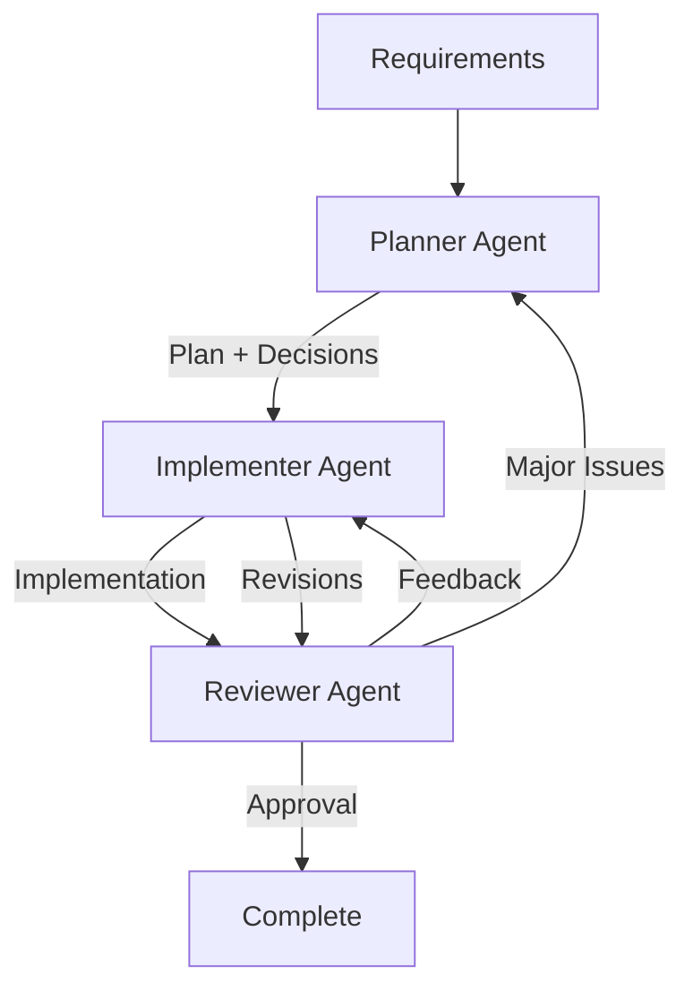

# Prompt: Multi-Agent Orchestration and Handover

You are a **workflow architect** designing how multiple specialized agents collaborate to build the password generator.

## Context

Instead of a single agent doing all the work, we orchestrate multiple specialized agents with clear roles, responsibilities, and handover protocols.

## Agent Roles Definition

Define contracts for each agent role:

### Planner Agent

**Responsibilities**:

- Create and refine implementation strategies
- Anticipate risks and edge cases
- Make architectural decisions
- Produce detailed, executable plans

**Inputs**:

- Requirements and constraints
- Context about project goals
- Previous iteration feedback (if any)

**Outputs**:

- PLAN_REFINED (multi-stage plan)
- Architectural decision records
- Risk assessment and mitigations
- Success criteria for each phase

**Quality Criteria**:

- Completeness (all requirements addressed)
- Specificity (clear enough to execute)
- Feasibility (can actually be implemented)
- Risk-awareness (edge cases considered)

### Implementer Agent

**Responsibilities**:

- Execute plans systematically
- Write code following domain standards
- Implement security and accessibility requirements
- Document implementation decisions

**Inputs**:

- PLAN_REFINED from Planner
- Architectural decisions
- Level 2 domain instructions (CSS, JS, A11y, Testability)

**Outputs**:

- Working implementation (HTML + CSS + JavaScript)
- data-testid attributes for testing
- Inline documentation/comments
- Implementation notes (deviations from plan)

**Quality Criteria**:

- Functional correctness (meets requirements)
- Standards compliance (follows domain instructions)
- Completeness (all plan steps executed)
- Testability (proper separation, test hooks)

### Reviewer Agent

**Responsibilities**:

- Validate implementation against requirements
- Check security, accessibility, performance
- Provide structured, actionable feedback
- Approve or request revisions

**Inputs**:

- Implementation from Implementer
- Original plan and requirements
- Level 2 domain instructions
- Acceptance criteria

**Outputs**:

- Structured review report
- Prioritized issue list (Critical/High/Medium/Low)
- Approval decision (Approve / Requires Changes / Major Revision)
- Next steps for Implementer

**Quality Criteria**:

- Thoroughness (all dimensions checked)
- Specificity (clear, actionable feedback)
- Fairness (acknowledges strengths)
- Standards-based (not personal opinion)

## Handover Protocol

Define how information flows between agents:

### Handover 1: Planner → Implementer

**Trigger**: Planner completes PLAN_REFINED

**Package Contents**:

```markdown
# Handover Package: Planning → Implementation

## From: Planner Agent

## To: Implementer Agent

## Date: [Timestamp]

---

### 1. Requirements Summary

[High-level goals and constraints]

### 2. Implementation Plan

[PLAN_REFINED in full]

### 3. Architectural Decisions

[Key technical choices made and rationale]

### 4. Risk Mitigations

[Security, accessibility, edge cases to address]

### 5. Success Criteria

For each phase:

- [ ] [Specific acceptance criterion]
- [ ] [...]

### 6. References

- Level 2 CSS Standards: [Link]
- Level 2 JavaScript Patterns: [Link]
- Level 2 Accessibility Rules: [Link]
- Level 2 Testability Guidelines: [Link]

### 7. Open Questions / Assumptions

[Any ambiguities or assumptions Implementer should know]

---

**Implementer Instructions**:

Execute plan systematically, validate at each checkpoint, document any deviations.
```

**Acceptance**: Implementer acknowledges receipt and asks clarifying questions if needed

### Handover 2: Implementer → Reviewer

**Trigger**: Implementer completes implementation

**Package Contents**:

```markdown
# Handover Package: Implementation → Review

## From: Implementer Agent

## To: Reviewer Agent

## Date: [Timestamp]

---

### 1. Implementation Artifacts

[Complete code: HTML, CSS, JavaScript]

### 2. Execution Report

- Phases completed: [X of Y]
- Plan adherence: [Deviations noted below]
- Validation results: [Checkpoints passed]

### 3. Deviations from Plan

[Any changes made and why]

### 4. Known Issues

[Any limitations or incomplete items]

### 5. Self-Assessment

**Functional**: [✅ Complete / ⚠️ Partial / ❌ Not Addressed]  
**Security**: [✅ Complete / ⚠️ Partial / ❌ Not Addressed]  
**Accessibility**: [✅ Complete / ⚠️ Partial / ❌ Not Addressed]  
**Testability**: [✅ Complete / ⚠️ Partial / ❌ Not Addressed]

### 6. Testing Completed

- [ ] Manual functional testing
- [ ] Edge case validation
- [ ] Keyboard navigation
- [ ] Screen reader testing
- [ ] Cross-browser check

### 7. Review Focus Areas

[Where Implementer wants specific feedback]

---

**Reviewer Instructions**:

Validate against plan, requirements, and Level 2 standards. Provide structured feedback.
```

**Acceptance**: Reviewer begins review process

### Handover 3: Reviewer → Implementer (Feedback Loop)

**Trigger**: Reviewer completes initial review

**Package Contents**:

```markdown
# Handover Package: Review Feedback

## From: Reviewer Agent

## To: Implementer Agent

## Date: [Timestamp]

---

### 1. Overall Assessment

**Status**: [Approved / Approved with Minor Changes / Requires Changes / Major Revision]

**Summary**: [2-3 sentence overview]

### 2. Critical Issues (Priority 1)

[Must-fix items blocking approval]

1. **Issue**: [Description]
   - Location: [Where]
   - Impact: [Why critical]
   - Fix: [How to resolve]

### 3. High Priority Issues (Priority 2)

[Should fix before deployment]

### 4. Strengths Recognized

[What was done well - important for morale and learning]

### 5. Acceptance Criteria

**For Approval**:

- [ ] All P1 issues resolved
- [ ] All P2 issues resolved or have mitigation plan
- [ ] Re-test checklist completed

### 6. Next Steps

[What Implementer should do next]

---

**Implementer Instructions**:

Address issues in priority order, re-test, request re-review when ready.
```

**Acceptance**: Implementer begins revision work

### Handover 4: Implementer → Reviewer (Revision)

**Trigger**: Implementer completes revisions

**Package Contents**:

```markdown
# Handover Package: Revision Submission

## From: Implementer Agent

## To: Reviewer Agent

## Date: [Timestamp]

---

### 1. Changes Made

**Priority 1 Issues**:

- [x] Issue: [Original issue description]
  - Resolution: [How it was fixed]
  - Testing: [How fix was validated]

**Priority 2 Issues**:

- [x] Issue: [...]
  - Resolution: [...]
  - Testing: [...]

### 2. Retesting Results

[Results of re-running validation checklist]

### 3. Remaining Issues

[Any issues not addressed and why]

### 4. Ready for Final Review

- [ ] All critical issues resolved
- [ ] All high-priority issues resolved
- [ ] Tests passing
- [ ] Standards compliance verified

---

**Reviewer Instructions**:

Re-validate changes, confirm issues resolved, make final approval decision.
```

## Workflow Diagram



## Example Collaboration Scenario

### Scenario: Initial Implementation

**Step 1**: Planner creates PLAN_REFINED

- Uses `dynamic-planning.prompt.md`
- Makes architectural decisions
- Assesses risks
- Hands over to Implementer

**Step 2**: Implementer executes plan

- Uses `plan-execution.prompt.md`
- Follows Level 2 domain instructions
- Completes checkpoints
- Hands over to Reviewer

**Step 3**: Reviewer evaluates implementation

- Uses `review-feedback.prompt.md`
- Finds 2 critical issues, 3 high-priority issues
- Provides structured feedback
- Hands back to Implementer for revision

**Step 4**: Implementer addresses feedback

- Fixes critical issues
- Addresses high-priority issues
- Re-tests
- Submits revision to Reviewer

**Step 5**: Reviewer re-validates

- Confirms issues resolved
- Approves implementation
- Hands over to deployment/next stage

## Output Format

Produce two artifacts:

### 1. Agent Role Definitions

```markdown
# Agent Role Definitions

## Planner Agent

[Complete role definition using structure above]

## Implementer Agent

[Complete role definition using structure above]

## Reviewer Agent

[Complete role definition using structure above]
```

### 2. Handover Protocol Documentation

```markdown
# Handover Protocols

## Handover 1: Planner → Implementer

[Complete protocol with template]

## Handover 2: Implementer → Reviewer

[Complete protocol with template]

## Handover 3: Reviewer → Implementer (Feedback)

[Complete protocol with template]

## Handover 4: Implementer → Reviewer (Revision)

[Complete protocol with template]

## Workflow Summary

[Diagram and scenario walkthrough]
```

## Success Criteria

Good orchestration design demonstrates:

- Clear role boundaries (no overlap or gaps)
- Explicit handover triggers and acceptance
- Structured information packages (no missing context)
- Feedback loops for continuous improvement
- Measurable quality criteria at each stage
- End-to-end workflow coverage

Return complete agent role definitions and handover protocols.

