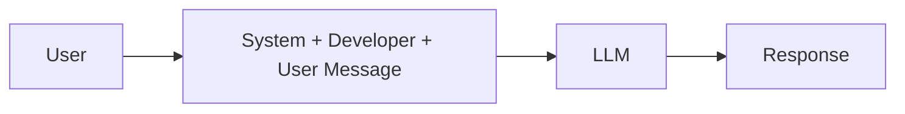
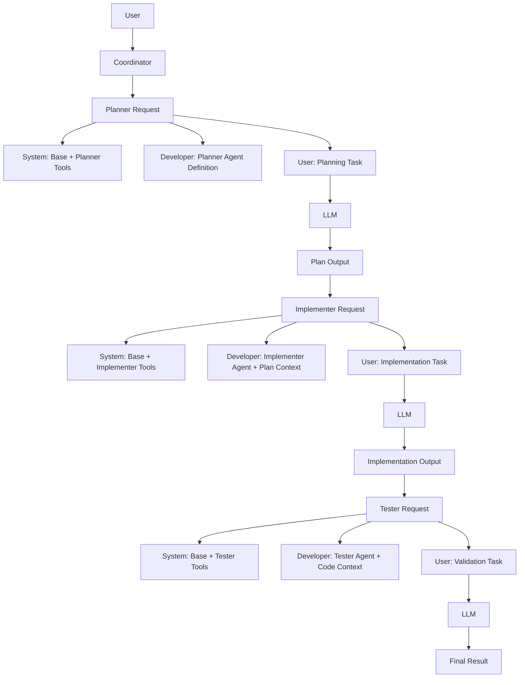
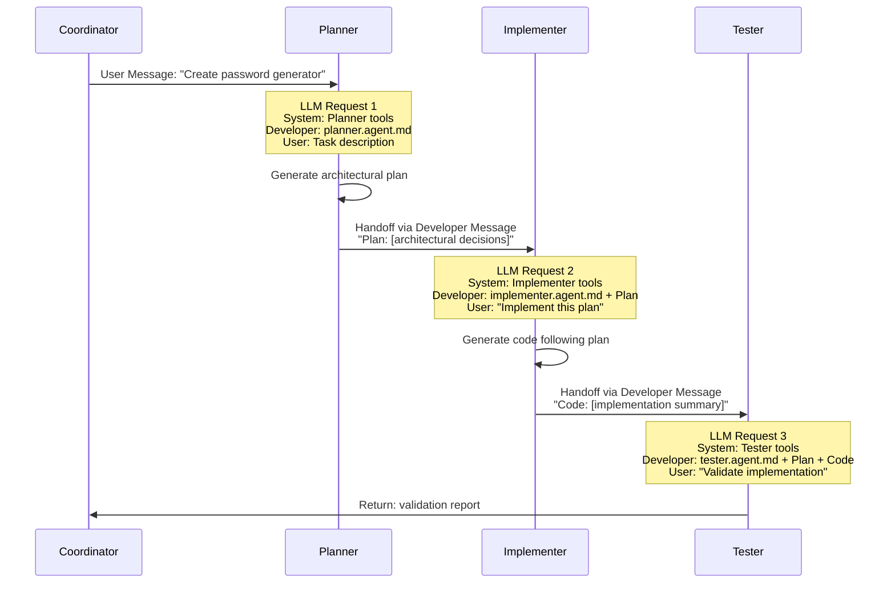
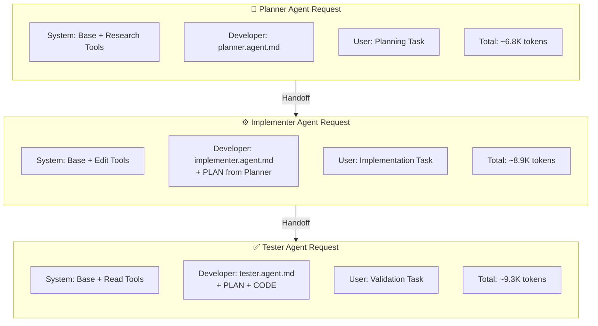
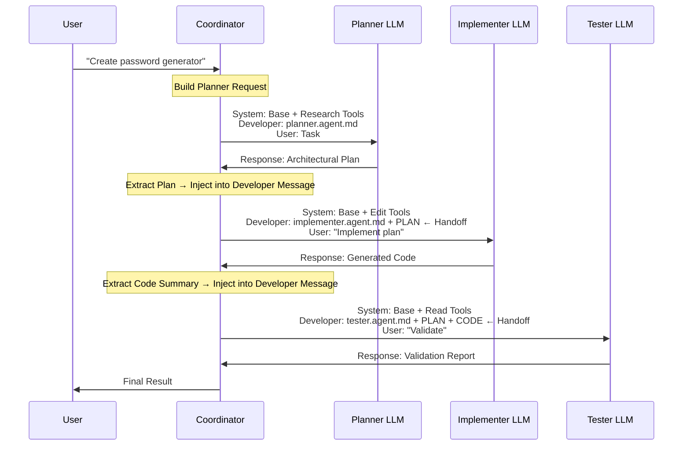

# Level 3: Advanced - Multi-Agent Orchestration

This level showcases advanced prompting patterns for building a coordinated **multi-agent** workflow that plans, implements, and validates a secure password generator web app.

> **📖 Complete Message Structure Guide**: For a detailed explanation of how message structure differs per agent and how handoffs work, see [MESSAGE-STRUCTURE-REFERENCE.md](../MESSAGE-STRUCTURE-REFERENCE.md)

## Concept: Multi-Agent Collaboration

Instead of a single agent doing all the work, we orchestrate multiple specialized agents:

- **Planner Agent**: Strategy and architecture (WHAT and WHY)
- **Implementer Agent**: Execution and coding (HOW)
- **Tester Agent**: Validation and quality assurance (HOW WELL)
- **Coordinator Agent**: Orchestration and handoffs

## Prompt Anatomy: Multi-Agent Message Structure

In Level 3, **each agent** gets its own specialized context. Understanding how messages flow between agents is critical.

### Single Agent Request vs Multi-Agent Pipeline

**Level 1-2 (Single Agent):**


**Level 3 (Multi-Agent):**


### Message Structure Per Agent

Each agent has a **customized message structure**:

#### Planner Agent Request

```mermaid
flowchart TD
    subgraph Planner LLM Request
        direction TB
        
        subgraph SM[System Message - 4500 tokens]
            SM1[Agent Role: Planning Expert]
            SM2[Available Tools: codebase, semantic_search]
            SM3[Workspace Context]
        end
        
        subgraph DM[Developer Message - 2000 tokens]
            DM1[planner.agent.md Definition: 800 tokens]
            DM2[advanced-planning.instructions.md: 600 tokens]
            DM3[agent-orchestration.instructions.md: 400 tokens]
            DM4[Skill: security-validation metadata: 200 tokens]
        end
        
        subgraph UM[User Message - 300 tokens]
            UM1[From Coordinator:<br/>"Create password generator"<br/>+ User requirements]
        end
        
        SM --> Total1[Total: ~6800 tokens]
        DM --> Total1
        UM --> Total1
    end
```

**What makes Planner different:**
- `tools: ["codebase", "semantic_search", "read_file"]` - Research tools only
- Planner-specific instructions about architecture
- No direct file editing capabilities

#### Implementer Agent Request  

```mermaid
flowchart TD
    subgraph Implementer LLM Request
        direction TB
        
        subgraph SM[System Message - 5000 tokens]
            SM1[Agent Role: Implementation Expert]
            SM2[Available Tools: editFiles, codebase]
            SM3[Workspace Context]
        end
        
        subgraph DM[Developer Message - 3500 tokens]
            DM1[implementer.agent.md Definition: 600 tokens]
            DM2[security-best-practices.instructions.md: 500 tokens]
            DM3[performance-best-practices.instructions.md: 500 tokens]
            DM4[Full SKILL.md: testing/SKILL.md: 1200 tokens]
            DM5[Planner's Output Plan: 700 tokens]
        end
        
        subgraph UM[User Message - 400 tokens]
            UM1[From Coordinator via Planner:<br/>"Implement according to plan"<br/>+ Plan details]
        end
        
        SM --> Total2[Total: ~8900 tokens]
        DM --> Total2
        UM --> Total2
    end
```

**What makes Implementer different:**
- `tools: ["editFiles", "codebase"]` - Can modify files
- Receives **Planner's output** in Developer Message (handoff context)
- Full skill instructions loaded (not just metadata)

#### Tester Agent Request

```mermaid
flowchart TD
    subgraph Tester LLM Request
        direction TB
        
        subgraph SM[System Message - 4800 tokens]
            SM1[Agent Role: Quality Assurance Expert]
            SM2[Available Tools: codebase, run_tests]
            SM3[Workspace Context with Generated Files]
        end
        
        subgraph DM[Developer Message - 4000 tokens]
            DM1[tester.agent.md Definition: 700 tokens]
            DM2[security-validation/SKILL.md: 1500 tokens]
            DM3[testing/SKILL.md: 1200 tokens]
            DM4[Planner's Plan: 300 tokens]
            DM5[Implementer's Code Summary: 300 tokens]
        end
        
        subgraph UM[User Message - 500 tokens]
            UM1[From Coordinator:<br/>"Validate implementation"<br/>+ Success criteria]
        end
        
        SM --> Total3[Total: ~9300 tokens]
        DM --> Total3
        UM --> Total3
    end
```

**What makes Tester different:**
- **Cannot edit files** - read-only tools
- Receives context from **both previous agents**
- Multiple full SKILLs loaded (security + testing)

### Agent Handoff: Context Transfer

When agents hand off, context flows through the **Developer Message**:



### Token Distribution Across Agents

| Component | Planner | Implementer | Tester |
|-----------|---------|-------------|--------|
| **System Message** | 4,500 | 5,000 | 4,800 |
| Agent Definition | 800 | 600 | 700 |
| Instructions | 1,000 | 1,000 | 0 |
| **Handoff Context** | **0** | **700 (Plan)** | **600 (Plan+Code)** |
| Skills (full) | 0 | 1,200 | 2,700 |
| **User Message** | 300 | 400 | 500 |
| **TOTAL** | **~6,800** | **~8,900** | **~9,300** |

**Key Insight**: Each subsequent agent request gets **larger** as context accumulates through handoffs.

### Where Agent Definitions Go

Agent `.agent.md` files are injected into the **Developer Message**:

```yaml
---
description: "Planning agent for architecture decisions"
tools: ["codebase", "semantic_search", "read_file"]
handoff: ["implementer"]  # Can hand off to implementer
---

You are a planning specialist. Your role is to:
1. Analyze requirements thoroughly
2. Design architecture and data structures  
3. Identify risks and constraints
4. Create detailed implementation plan
5. Hand off to implementer agent

When complete, use the handoff mechanism to pass your plan.
```

**This entire file** (minus frontmatter) goes into the Developer Message for that agent.

### Multi-Agent Token Budget

**Total pipeline cost** (all three agents):
```
Planner Request:       6,800 tokens
  + Planner Response:  1,500 tokens
Implementer Request:   8,900 tokens  (includes Plan)
  + Implementer Response: 3,000 tokens
Tester Request:        9,300 tokens  (includes Plan + Code)
  + Tester Response:   2,000 tokens
────────────────────────────────────
TOTAL PIPELINE:       31,500 tokens
```

**Comparison to Level 1:**
- Level 1 single request: ~8,500 tokens
- Level 3 pipeline: ~31,500 tokens (~3.7x)

**Why it's worth it:**
- Higher quality through specialization
- Structured validation
- Clear separation of concerns
- Reproducible process

### Practical Implications

**Agent Tool Restrictions** shape the System Message:
```yaml
# planner.agent.md
tools: ["codebase", "semantic_search"]  
# → System Message includes only these tools
# → Prevents planner from editing files

# implementer.agent.md  
tools: ["editFiles", "codebase"]
# → System Message includes file editing
# → Implementer can modify workspace
```

**Handoff Protocol** augments the Developer Message:
```yaml
# planner.agent.md
handoff: ["implementer"]

# When planner completes:
# Coordinator extracts plan → Injects into implementer's Developer Message
```

**Skill Loading** is progressive:
```yaml
# Metadata always in Developer Message (200 tokens):
- testing/SKILL.md: name + description

# Full skill loaded when agent needs it (1200 tokens):
- implementer uses testing skill → Full SKILL.md loaded
- planner doesn't → Only metadata present
```

### Further Reading

- For foundational message structure: [Level 1 README - Prompt Anatomy](../level-1-basic/README.md#prompt-anatomy-where-each-component-goes)
- For instruction injection: [Level 2 README - Message Structure](../level-2-intermediate/README.md#prompt-anatomy-message-structure-in-level-2)

## The Task

Create a secure password generator web app using a structured, multi-agent workflow with planning, execution, and validation phases.

## Folder Structure

```text
level-3-advanced/
├── .github/
│   ├── copilot-instructions.md           # Project overview
│   ├── agents/                           # Specialized agents
│   │   ├── coordinator.agent.md
│   │   ├── implementer.agent.md
│   │   ├── planner.agent.md
│   │   └── tester.agent.md
│   ├── instructions/                     # Domain instructions
│   │   ├── advanced-planning.instructions.md
│   │   ├── agent-orchestration.instructions.md
│   │   ├── performance-best-practices.instructions.md
│   │   └── security-best-practices.instructions.md
│   ├── prompts/                          # Task prompts
│   │   ├── architecture-decision.prompt.md
│   │   ├── dynamic-planning.prompt.md
│   │   ├── plan-execution.prompt.md
│   │   ├── review-feedback.prompt.md
│   │   ├── risk-assessment.prompt.md
│   │   └── subagent-handover.prompt.md
│   └── skills/                           # Specialized workflows with resources
│       ├── testing/
│       │   ├── SKILL.md
│       │   └── test-template.js
│       ├── security-validation/
│       │   ├── SKILL.md
│       │   └── security-checklist.md
│       └── deployment/
│           ├── SKILL.md
│           └── deploy-script.sh
└── README.md
```

## Agents

### Planner Agent
- Creates multi-stage implementation plans
- Makes architectural decisions
- Assesses risks and defines mitigations
- Hands off to Implementer

### Implementer Agent
- Executes plans phase by phase
- Follows domain instructions
- Documents deviations
- Hands off to Tester

### Tester Agent
- Reviews code against requirements
- Validates security and accessibility
- Provides structured feedback
- Approves or requests revisions

### Coordinator Agent
- Maintains global project view
- Manages handoffs between agents
- Resolves conflicts
- Drives project to completion

## Workflow

```text
                    ┌─────────────┐
                    │ Coordinator │
                    └──────┬──────┘
                           │
              ┌────────────┼────────────┐
              ▼            ▼            ▼
        ┌─────────┐  ┌───────────┐  ┌────────┐
        │ Planner │──│Implementer│──│ Tester │
        └─────────┘  └───────────┘  └────────┘
              │            ▲            │
              │            │            │
              └────────────┴────────────┘
                    Feedback Loop
```

## Key Differences from Level 1 & 2

| Aspect | Level 1 | Level 2 | Level 3 (This) |
|--------|---------|---------|----------------|
| Agents | Single | Single | Multiple |
| Planning | Implicit | Minimal | Multi-stage |
| Workflow | Linear | Sequential | Iterative |
| Handoffs | None | None | Structured |
| Skills | None | Simple | With resources |
| Best For | Prototypes | Production | Complex projects |

## Agent Skills

Skills in Level 3 include additional resources (scripts, templates, examples) alongside instructions.

### Skills in This Level

| Skill | Resources | Purpose |
|-------|-----------|---------|
| `testing/` | `SKILL.md`, `test-template.js` | Comprehensive testing workflow with templates |
| `security-validation/` | `SKILL.md`, `security-checklist.md` | Security audit with checklist |
| `deployment/` | `SKILL.md`, `deploy-script.sh` | Deployment workflow with verification script |

### Progressive Disclosure

Skills use a three-level loading system:
1. **Discovery**: Copilot reads skill `name` and `description` from frontmatter
2. **Instructions**: When relevant, `SKILL.md` body is loaded into context
3. **Resources**: Additional files (scripts, templates) loaded only when referenced

### Skills vs Instructions

| Use Skills When | Use Instructions When |
|-----------------|----------------------|
| Need scripts or templates | Just need coding guidelines |
| Defining specialized workflows | Setting project standards |
| Want cross-platform portability | Applying rules to file types |
| Creating reusable capabilities | Defining language conventions |

## Learning Objectives

- Understand agent definition with tools and handoffs
- Learn multi-agent collaboration patterns
- See how to structure planning with self-review
- Practice risk assessment and mitigation
- Implement structured feedback loops

## Link utili (Copilot + prompt files)

- GitHub Copilot docs: https://docs.github.com/en/copilot
- GitHub Copilot (repository custom instructions): https://docs.github.com/en/copilot/customizing-copilot/adding-repository-custom-instructions-for-github-copilot
- VS Code Copilot Chat docs (prompt files / agent mode): https://code.visualstudio.com/docs/copilot/copilot-chat
- Esempi community (prompts/instructions):
      - https://github.com/github/awesome-copilot/tree/main/prompts
      - https://github.com/github/awesome-copilot/tree/main/instructions
- Agent Skills documentation:
      - https://docs.github.com/en/copilot/concepts/agents/about-agent-skills
      - https://code.visualstudio.com/docs/copilot/customization/agent-skills
      - https://agentskills.io (open standard)
- Esempi skills:
      - https://github.com/anthropics/skills
      - https://github.com/github/awesome-copilot

## Quick Reference: Multi-Agent Message Structure

### Message Structure Evolution

```mermaid
flowchart LR
    subgraph Level1["Level 1: Single Agent"]
        L1_Sys[System: 3K tokens]
        L1_Dev[Developer: 0.2K tokens]
        L1_User[User: 0.3K tokens]
        L1_Total[Total: ~3.5K]
    end
    
    subgraph Level2["Level 2: Instructed Agent"]
        L2_Sys[System: 4K tokens]
        L2_Dev[Developer: 3.5K tokens<br/>← Instructions!]
        L2_User[User: 0.4K tokens]
        L2_Total[Total: ~8K]
    end
    
    subgraph Level3["Level 3: Multi-Agent Pipeline"]
        L3_P[Planner: 6.8K tokens]
        L3_I[Implementer: 8.9K tokens]
        L3_T[Tester: 9.3K tokens]
        L3_Total[Total: ~25K pipeline]
    end
    
    Level1 -->|Add Instructions| Level2
    Level2 -->|Add Agents| Level3
```



### Per-Agent Message Structure



### What You Control in Level 3

| Message Type | Control Per Agent | How | Impact |
|-------------|-------------------|-----|--------|
| **System** | ⚠️ Partial | `tools` array in agent frontmatter | Tool availability per agent |
| **Developer** | ✅ **Full** | **Agent-specific `.agent.md` files** | **Role specialization** |
| **Developer** | ✅ Full | Instructions files | Standards enforcement |
| **Developer** | ✅ Full | Skills (full SKILL.md) | Workflow definitions |
| **Developer** | ⚠️ Automated | **Handoff context** | **Inter-agent communication** |
| **User** | ✅ Full | Coordinator orchestration | Task routing |

### Token Budget: Complete Pipeline

```
┌─────────────────────────────────────────────────────────────────┐
│ Context Window: 128,000 tokens (per request)                   │
├─────────────────────────────────────────────────────────────────┤
│                                                                 │
│ 1. Planner Request:                                            │
│ ████████████░░░░░░░░░░░░░░░░░░░░░░░░░░░░░░░░░░░░░░░░░         │
│ 6,800 tokens + 1,500 response = 8,300 tokens                  │
│                                                                 │
│ 2. Implementer Request (includes Plan):                        │
│ ████████████████░░░░░░░░░░░░░░░░░░░░░░░░░░░░░░░░░░░░          │
│ 8,900 tokens + 3,000 response = 11,900 tokens                 │
│                                                                 │
│ 3. Tester Request (includes Plan + Code):                      │
│ ██████████████████░░░░░░░░░░░░░░░░░░░░░░░░░░░░░░░░░░          │
│ 9,300 tokens + 2,000 response = 11,300 tokens                 │
│                                                                 │
│ TOTAL PIPELINE: ~31,500 tokens (all agents combined)          │
│                                                                 │
└─────────────────────────────────────────────────────────────────┘
```

### Handoff Context Flow



### Agent-Specific Tool Restrictions

```yaml
# planner.agent.md
tools: ["codebase", "semantic_search", "read_file"]
# ✓ Can research
# ✗ Cannot edit files

# implementer.agent.md
tools: ["editFiles", "codebase", "read_file"]
# ✓ Can research
# ✓ Can edit files
# ✗ Cannot run tests

# tester.agent.md
tools: ["codebase", "read_file", "run_tests"]
# ✓ Can research
# ✓ Can run tests
# ✗ Cannot edit files (read-only validation)
```

These tool restrictions appear in each agent's **System Message**, preventing inappropriate actions.

### Mini-cheatsheet: frontmatter (YAML)

**Prompt** (`.github/prompts/*.prompt.md`)

```yaml
---
description: "Cosa fa questo prompt"
mode: "agent" # oppure: "chat"
tools: ["editFiles", "runInTerminal"] # opzionale
---
```

**Instructions** (`.github/instructions/*.instructions.md`)

```yaml
---
description: "Regole riusabili (brevi)"
applyTo: "**/*.js"
---
```

**Agent** (`.github/agents/*.agent.md`)

```yaml
---
description: "Ruolo dell’agente"
tools: ["codebase", "editFiles"]
---
```

**Skill** (.github/skills/{skill-name}/SKILL.md)

```yaml
---
name: skill-name-lowercase-hyphens
description: "What the skill does and when Copilot should use it"
license: MIT  # optional
---

# Instructions
Step-by-step instructions, examples, and guidelines.

## Resources
Include scripts, templates, or examples in the same folder.
```

## Nanoagent: Executable Python Example

The `nanoagent/` folder contains a multi-agent Python implementation demonstrating orchestration and handoffs.

### What It Demonstrates
- Multi-agent architecture (Planner, Implementer, Tester)
- Structured agent handoffs with message passing
- Shared context through the pipeline
- Orchestrator pattern for workflow management

### Quick Start
```bash
cd nanoagent
uv sync
uv run orchestrator.py --mock "Generate a secure password"
```

### Code Structure
| File | Purpose |
|------|---------|
| `orchestrator.py` | Main coordinator managing the pipeline |
| `agents/base.py` | BaseAgent class, AgentContext, AgentMessage |
| `agents/planner.py` | Planning agent (analyzes requirements) |
| `agents/implementer.py` | Implementation agent (generates password) |
| `agents/tester.py` | Testing agent (validates results) |
| `tools/shared_tools.py` | Tools shared across agents |

See `nanoagent/README.md` for full documentation.
